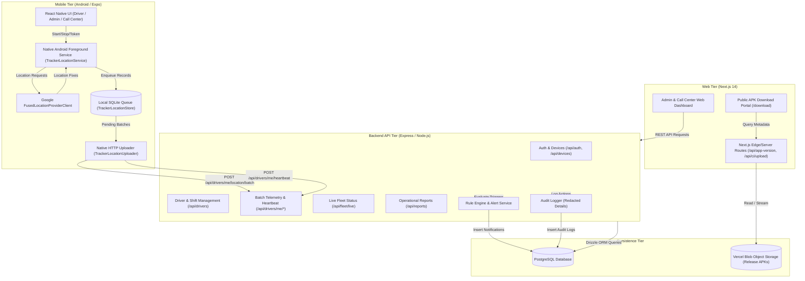
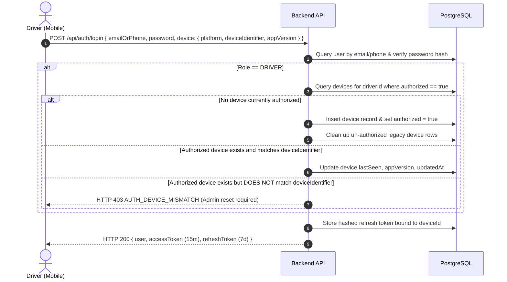
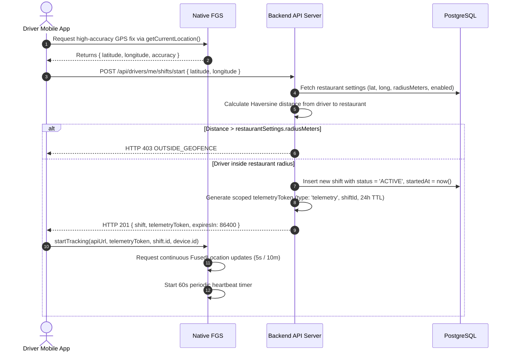
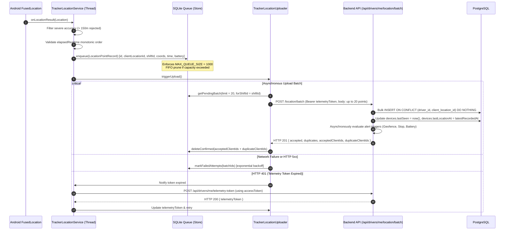
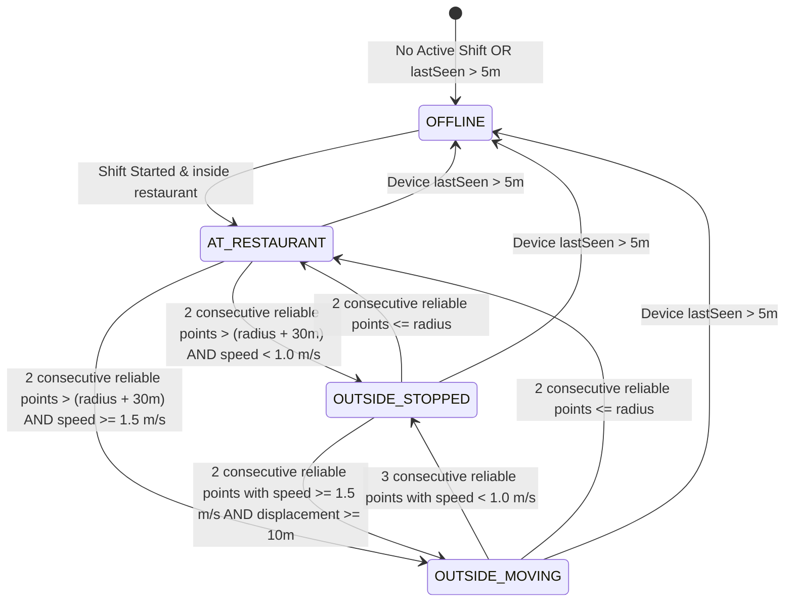

# Tracker System Architecture

> Practical Single Source of Truth for Tracker's End-to-End System Architecture.  
> Verified against production source code (`v1.2.0`, `versionCode: 35`).

---

## 1. High-Level Architectural Overview

Tracker is an operational fleet monitoring and driver visibility platform designed for restaurant delivery fleets. It enables real-time location tracking, automated restaurant geofence detection, stationary stop alerts, durable offline telemetry buffering, shift lifecycle governance, and administrative oversight.

The system is organized as a pnpm monorepo containing three core runtime tiers, accompanied by shared contracts and database models:

1. **Mobile Application (`apps/mobile`)**: Built with React Native 0.79 and Expo 53, utilizing a custom native Android Kotlin foreground service (`TrackerLocationService`) with Google Play Services `FusedLocationProviderClient`, a local SQLite durable queue (`TrackerLocationStore`), and an asynchronous native HTTP uploader (`TrackerLocationUploader`).
2. **Web Administrative Console (`apps/web`)**: Built with Next.js 14 (App Router) and Tailwind CSS, providing desktop and tablet browser visibility for Admins and Call Center operators. Also hosts public APK download and version query endpoints.
3. **Backend API Server (`artifacts/api-server`)**: Built with Express, TypeScript, and Drizzle ORM, serving REST API endpoints, enforcing JWT and device authentication, evaluating geofence and stop rules, ingesting batched telemetry, and publishing audit trails.
4. **Shared Database & Contracts (`lib/*`)**: PostgreSQL managed via Drizzle ORM (`lib/db`), shared OpenAPI 3.0 specification (`lib/api-spec`), Zod validation schemas (`lib/api-zod`), and generated React Query hooks (`lib/api-client-react`).



---

## 2. Core Components and Responsibilities

### 2.1 Mobile Application (`apps/mobile`)

| Component | Technology | Primary Responsibility |
| :--- | :--- | :--- |
| **Driver Cockpit** | React Native / TypeScript | Single-glance status answering: *Am I tracked? Am I on shift? Is GPS working? Is my device online? How many points pending?* |
| **Admin Mobile Console** | React Native / Leaflet WebView | Operational monitoring on mobile devices: live map, driver details, force-end shifts, device management, reports, and settings. |
| **Call Center Console** | React Native / Leaflet WebView | Read-only operational console for fleet monitoring and customer support dispatch. |
| **`TrackerLocationService`** | Android Native (Kotlin) | Foreground service (`FOREGROUND_SERVICE_TYPE_LOCATION`) with persistent status bar notification, ensuring continuous execution across app backgrounding and screen lock. |
| **`TrackerLocationStore`** | SQLite (`SQLiteOpenHelper`) | Durable, transactional on-device storage queue (`tracker_telemetry_queue.db`) capped at 1,000 records. Guarantees zero data loss during network blackouts. |
| **`TrackerLocationUploader`** | Java / Kotlin (`HttpURLConnection`) | Asynchronous, single-threaded worker that uploads location batches (up to 20 records) and heartbeats to the API server. |
| **`TrackerUpdateModal`** | Expo / React Native | Soft update prompt querying `/api/app-version` on startup and triggering in-app APK download/installation via `expo-file-system`. |

### 2.2 Web Administrative Application (`apps/web`)

| Route / Component | Primary Responsibility | Target Roles |
| :--- | :--- | :--- |
| `/dashboard` | Fleet summary KPI cards, active drivers list, quick filters. | `ADMIN`, `CALL_CENTER` |
| `/dashboard/map` | Full-screen interactive Leaflet map with real-time driver positions and restaurant geofence overlay. | `ADMIN`, `CALL_CENTER` |
| `/dashboard/drivers` | Driver directory, active shift badges, battery indicators, search, and navigation to driver details. | `ADMIN`, `CALL_CENTER` |
| `/dashboard/drivers/[id]` | Comprehensive driver dossier: live telemetry, shift timeline, location history breadcrumbs, and device bindings. | `ADMIN`, `CALL_CENTER` |
| `/dashboard/reports` | Operational report generator: shift counts, work duration, kilometers traveled, stationary times, and alert counts. | `ADMIN`, `CALL_CENTER` |
| `/dashboard/devices` | Device authorization console: view registered devices, authorized flags, last seen timestamps, and reset/assign actions. | `ADMIN` |
| `/dashboard/users` | User management: create, update, deactivate, and permanently delete accounts. | `ADMIN` |
| `/dashboard/audit` | Comprehensive audit trail table with actor identification, IP logging, and sensitive data redaction. | `ADMIN` |
| `/dashboard/settings` | Restaurant geofence parameters (lat/long/radius) and alert threshold configuration. | `ADMIN` |
| `/download` | Public release portal displaying latest APK version, release notes, SHA-256 hash, and download button. | Public |
| `/api/app-version` | Next.js API route reading `latest.json` from Vercel Blob and returning release metadata. | Public / Mobile App |
| `/api/download/latest` | Next.js API route redirecting (HTTP 302) to the current production APK in Vercel Blob storage. | Public |
| `/api/ci/upload` | Secured webhook for GitHub Actions to push release APKs into Vercel Blob storage. | CI Automation |

### 2.3 Backend API Server (`artifacts/api-server`)

| Layer / Service | File Path | Primary Responsibility |
| :--- | :--- | :--- |
| **Express App** | `src/app.ts`, `src/routes/index.ts` | HTTP request routing, CORS origin filtering, rate limiting (auth: 20/15m; telemetry: 120/1m), error sanitization. |
| **Authentication Service** | `src/services/authService.ts` | Password verification (scrypt), JWT issuance, refresh token rotation, driver single-device binding, and telemetry token issuance. |
| **Fleet Service** | `src/services/fleetService.ts` | Live fleet aggregation (`/api/fleet/live`), multi-sample hysteresis evaluation, operational state machine computation. |
| **Alert Engine** | `src/services/alertService.ts` | Asynchronous trigger evaluation for restaurant arrival/departure, extended stops outside geofence, low battery, and offline states. |
| **Notification Service** | `src/services/notificationService.ts` | Unified notification creation, user-scoped read tracking (`notification_reads`), resolution, and batch queries. |
| **Reporting Service** | `src/services/reportService.ts` | Shift aggregation, distance integration with GPS filtering, stationary/moving duration calculations. |
| **Audit Service** | `src/services/auditService.ts` | Structured event logging (`audit_logs`) with automatic masking of sensitive keys (`password`, `token`, `secret`). |
| **Retention Service** | `src/services/retentionService.ts` | Automated hourly cleanup of location points older than 48 hours to conserve database capacity. |

---

## 3. End-to-End Data & Execution Flows

### 3.1 Authentication & Device Binding Flow

Drivers are strictly bound to a single authorized device. Non-driver administrative roles (`ADMIN`, `CALL_CENTER`) may log in from multiple browser sessions.



### 3.2 Shift Startup with Restaurant Geofence Validation

A driver cannot start tracking or begin work without being physically present inside the designated restaurant geofence.



### 3.3 Telemetry Acquisition, Queueing, and Batch Upload Pipeline

Location data flows through an uncompromising native Android pipeline engineered to survive cellular drops, process death, and aggressive OEM memory killers.



### 3.4 Operational Status Multi-Sample State Machine

Operational state is not derived from a single noisy GPS point. The backend executes a multi-sample evaluation over the driver's recent location history window (up to 10 points):



---

## 4. Web, Mobile, and API Contract Relationships

The repository maintains strict API type safety through code generation:

1. **OpenAPI Contract (`lib/api-spec/openapi.yaml`)**: The single specification defining all data models, parameters, and responses.
2. **Orval Client Generator (`lib/api-spec/orval.config.ts`)**:
   - Generates Zod runtime validation schemas into `lib/api-zod`.
   - Generates React Query hooks and custom fetch clients into `lib/api-client-react`.
3. **API Implementation (`artifacts/api-server`)**: Validates incoming request payloads against the generated Zod schemas or route-level schemas, returning standardized error envelopes:
   ```json
   {
     "error": {
       "code": "OUTSIDE_GEOFENCE",
       "message": "Driver must be inside restaurant geofence to start shift",
       "details": {}
     }
   }
   ```

---

## 5. Security & Isolation Architecture

- **Token Segregation**: General management API operations require standard Bearer access tokens (`role: ADMIN | CALL_CENTER | DRIVER`). Native telemetry uploads require scoped telemetry tokens (`type: 'telemetry'`, restricted exclusively to `POST /location`, `POST /location/batch`, and `POST /heartbeat`).
- **Shift Queue Isolation**: A telemetry record belonging to Shift A cannot be uploaded under Shift B. Any attempt results in HTTP 409 `SHIFT_MISMATCH`, preventing historical queue corruption.
- **Audit Masking**: Passwords, hashes, JWTs, and refresh tokens are intercepted and converted to `[REDACTED]` prior to insertion into the `audit_logs` table.
- **CORS Defense**: The backend API rejects unauthorized browser origins by default. Only origins explicitly defined in `CORS_ALLOWED_ORIGINS` are granted access. Mobile requests (which do not emit an `Origin` header) are permitted.
- **Supply-Chain Guard**: `pnpm-workspace.yaml` enforces `minimumReleaseAge: 1440` (24 hours) to neutralize zero-day malicious npm packages.
