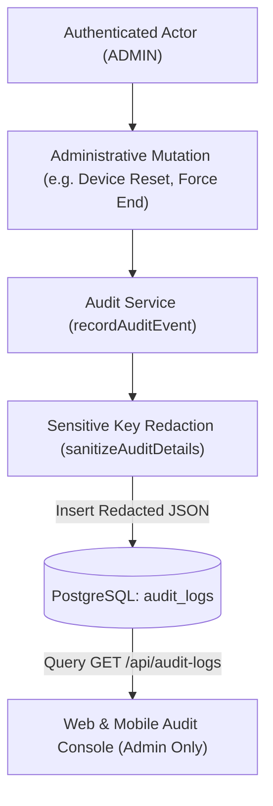

# Audit Log Specification

> Practical Single Source of Truth for System Auditing, Actor Identification, and Data Masking.  
> Verified against production audit services, database tables, and route handlers (`v1.2.0`).

---

## 1. Overview & Architectural Goals

The Audit Log system provides an append-only accountability trail recording significant administrative, security, and lifecycle mutations across Tracker.



---

## 2. Audited Actions & Entity Types

| Action Code | Entity Type | Trigger Event | Details Payload |
| :--- | :--- | :--- | :--- |
| **`USER_CREATED`** | `USER` | Admin provisions a new user. | `{ name, email, role, active }` |
| **`USER_UPDATED`** | `USER` | Admin updates name, email, or role. | `{ ...fields, password: "[REDACTED]" }` |
| **`USER_DEACTIVATED`** | `USER` | Admin soft-deactivates an account. | `{ targetUserId }` |
| **`USER_DELETED_PERMANENTLY`** | `USER` | Admin permanently purges a user record. | `{ targetUserId }` |
| **`DRIVER_CREATED`** | `DRIVER` | Admin registers a new driver profile. | `{ driverId, employeeId, name }` |
| **`DRIVER_UPDATED`** | `DRIVER` | Admin updates driver info/status. | `{ employeeId, active, password: "[REDACTED]" }` |
| **`DEVICE_RESET`** | `DEVICE` | Admin unbinds driver phone. | `{ driverId }` |
| **`DEVICE_ASSIGNED`** | `DEVICE` | Admin binds phone to driver. | `{ driverId, platform, deviceIdentifier }` |
| **`SHIFT_FORCE_ENDED`** | `SHIFT` | Admin forces closure of open shift. | `{ driverId, shiftId, endedAt }` |
| **`RESTAURANT_SETTINGS_UPDATED`** | `SETTINGS` | Admin updates geofence coordinates/radius. | `{ name, latitude, longitude, radiusMeters, enabled }` |
| **`ALERT_SETTINGS_UPDATED`** | `SETTINGS` | Admin tunes alert thresholds. | `{ maxStopDurationMinutes, lowBatteryThreshold, ... }` |

---

## 3. Sensitive Key Redaction Standards

To prevent credentials from leaking into query logs or administrative screens, `sanitizeAuditDetails()` scrubs payloads before database insertion:

```typescript
const SENSITIVE_KEYS = new Set([
  "password",
  "passwordhash",
  "token",
  "refreshtoken",
  "accesstoken",
  "telemetrytoken",
  "secret",
  "authorization",
  "cookie",
]);
```

- Any matching key (case-insensitive) is replaced with the literal string `"[REDACTED]"`.
- Nested objects are scrubbed recursively.
- Plaintext passwords or session tokens are **never written to the `audit_logs` table**.

---

## 4. Security & Access Boundaries

1. **Role Access**: Restricted exclusively to **`ADMIN`**. Attempting to query `/api/audit-logs` as `CALL_CENTER` or `DRIVER` results in **HTTP 403 `AUTH_FORBIDDEN`**.
2. **Actor Provenance**: Actor ID, email, and role are extracted directly from the cryptographically verified JWT (`req.user`), preventing impersonation.
3. **Network Provenance**: The client IP address is captured from `req.ip` (with `app.set("trust proxy", 1)` ensuring accurate upstream proxy IP resolution).
4. **Non-Blocking Reliability**: Audit logging failures are caught and logged to error streams without rolling back primary operational transactions.
5. **Realistic Security Boundary**: Audit records are stored in PostgreSQL with standard relational security. They do not claim immutable hardware WORM or distributed ledger guarantees.
