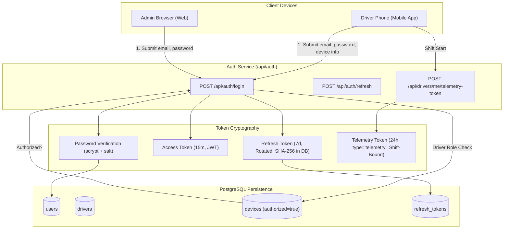

# Authentication & Device Authorization

> Practical Single Source of Truth for Authentication, Token Lifecycle, and Driver Hardware Binding.  
> Verified against production auth services and middleware (`v1.2.0`).

---

## 1. Authentication Architecture Overview

Tracker enforces a defense-in-depth authentication model tailored to operational field realities:

1. **Dual-Token System**: Short-lived JSON Web Tokens (Access Tokens, 15 minutes) combined with durable, rotated Refresh Tokens (7 days) stored as cryptographically hashed records in PostgreSQL.
2. **Driver Single-Device Binding**: Strict hardware-level binding for users with the `DRIVER` role. A driver account can only be active on one authorized device at any given moment.
3. **Telemetry Token Segregation**: Specialized, shift-bound tokens (`type: 'telemetry'`) granted exclusively to active drivers for high-frequency location streaming and heartbeat keepalives.
4. **Multi-Session Administration**: Administrative roles (`ADMIN` and `CALL_CENTER`) are permitted concurrent desktop and mobile logins without device hardware restrictions.



---

## 2. Driver Device Authorization Lifecycle

### 2.1 First-Time Driver Device Registration

When a newly provisioned driver logs in for the first time:

1. The mobile app collects hardware attributes (`platform: 'ANDROID'`, `deviceIdentifier` [unique Android device ID], `appVersion`).
2. The backend inspects `devices` for any existing row with `driverId = driver.id` and `authorized = true`.
3. If no authorized device exists, the incoming device is inserted, immediately marked `authorized = true`, and bound to the driver. Any stale un-authorized rows are pruned.
4. The generated refresh token is stamped with `deviceId = registeredDevice.id`.
5. The issued access token includes `deviceId` in its claims.

### 2.2 Re-Login on the Same Authorized Device

When a driver logs out or re-authenticates on their existing authorized phone:

1. The backend matches `deviceIdentifier` against the authorized device in `devices`.
2. Hardware metadata (`lastSeen`, `appVersion`, `updatedAt`) is updated in-place.
3. Login proceeds seamlessly without requiring administrator intervention.

### 2.3 Unauthorized Login Attempt (Device Mismatch)

If a driver attempts to log in from a secondary phone (or a friend's phone):

1. The backend detects that an authorized device already exists for this driver and its `deviceIdentifier` does not match the incoming device.
2. The login attempt is rejected immediately with **HTTP 403 `AUTH_DEVICE_MISMATCH`**:
   ```json
   {
     "error": {
       "code": "AUTH_DEVICE_MISMATCH",
       "message": "This account is linked to another device. An administrator must reset the device."
     }
   }
   ```
3. No tokens are issued. The existing authorized device remains undisturbed.

### 2.4 Administrative Device Reset Workflow

When a driver legitimately replaces their physical phone (e.g., lost, damaged, or upgraded device):

1. An Admin navigates to `/dashboard/devices` (Web) or `more -> devices` (Mobile).
2. The Admin triggers **Reset Device** (`POST /api/drivers/:id/device/reset`).
3. The backend executes an atomic transaction:
   - Sets `authorized = false` on the old device.
   - Revokes all refresh tokens associated with that device in `refresh_tokens`.
   - Records an audit event (`action: 'DEVICE_RESET'`).
4. The driver can now log in from their new phone. The new phone automatically registers as the primary authorized device.

### 2.5 Administrative Device Assignment Workflow

An Admin can proactively bind a specific device to a driver via `POST /api/drivers/:id/device/assign`:
- Atomically unauthorizes all existing devices for that driver.
- Revokes all previous tokens.
- Creates or updates the target device to `authorized = true`.
- Records an audit event (`action: 'DEVICE_ASSIGNED'`).

---

## 3. Token Specifications & Lifecycles

### 3.1 Access Token (General API)

- **Algorithm**: HMAC-SHA256 (`HS256`).
- **Secret**: `JWT_SECRET`.
- **TTL**: 15 minutes (`900` seconds).
- **Payload Structure**:
  ```json
  {
    "sub": "b2f69904-4e78-4392-a160-c3ecb2daea8d",
    "role": "DRIVER",
    "deviceId": "573b2229-ffc1-4ebc-9d62-d33a7638361b",
    "iat": 1727900000,
    "exp": 1727900900
  }
  ```
- **Scope**: Required for general endpoints (`requireAuth`). Telemetry tokens cannot be used here.

### 3.2 Refresh Token (Session Continuity)

- **Algorithm**: HMAC-SHA256 (`HS256`).
- **Secret**: `JWT_REFRESH_SECRET`.
- **TTL**: 7 days (`604800` seconds).
- **Payload Structure**:
  ```json
  {
    "sub": "b2f69904-4e78-4392-a160-c3ecb2daea8d",
    "role": "DRIVER",
    "jti": "8b51c890-c20e-4ba0-9fbb-ce2cfae8be4f",
    "type": "refresh",
    "iat": 1727900000,
    "exp": 1727904800
  }
  ```
- **Database Storage**: The raw token is hashed via SHA-256 before insertion into `refresh_tokens`. Raw tokens are never stored in plaintext.
- **Rotation**: Every successful call to `POST /api/auth/refresh` immediately revokes the old refresh token by hash and issues a brand new access and refresh token pair.

### 3.3 Telemetry Token (Native Location Streaming)

- **Algorithm**: HMAC-SHA256 (`HS256`).
- **Secret**: `JWT_SECRET`.
- **TTL**: 24 hours (`86400` seconds).
- **Payload Structure**:
  ```json
  {
    "sub": "b2f69904-4e78-4392-a160-c3ecb2daea8d",
    "role": "DRIVER",
    "type": "telemetry",
    "deviceId": "573b2229-ffc1-4ebc-9d62-d33a7638361b",
    "shiftId": "f7d383b1-8b77-4b7b-9f93-5eb7843818e6",
    "iat": 1727900000,
    "exp": 1727986400
  }
  ```
- **Security Boundary**:
  - Telemetry tokens are accepted **only** by routes wrapped with `requireAuthOrTelemetry` (`POST /api/drivers/me/location`, `POST /api/drivers/me/location/batch`, `POST /api/drivers/me/heartbeat`).
  - Attempting to call management endpoints (`/me`, `/me/shifts`, `/fleet/live`) with a telemetry token results in **HTTP 403 `AUTH_FORBIDDEN`** ("Telemetry token cannot be used for general API operations").
  - The token enforces shift isolation: if the token's `shiftId` differs from the driver's current active shift, ingestion is rejected with **HTTP 409 `SHIFT_NOT_ACTIVE`**.

---

## 4. Password Security Standards

1. Passwords must be at least 8 characters in length.
2. Passwords are hashed using Node.js native `crypto.scrypt`:
   - 64-byte key length.
   - 16-byte cryptographically secure random salt per user.
   - Output format stored as `salt:hexKey` in `users.password_hash`.
3. Password verification uses constant-time comparison (`timingSafeEqual`) to eliminate timing attacks.
4. Passwords and hashes are completely omitted from API responses via `sanitizeUser()`.
