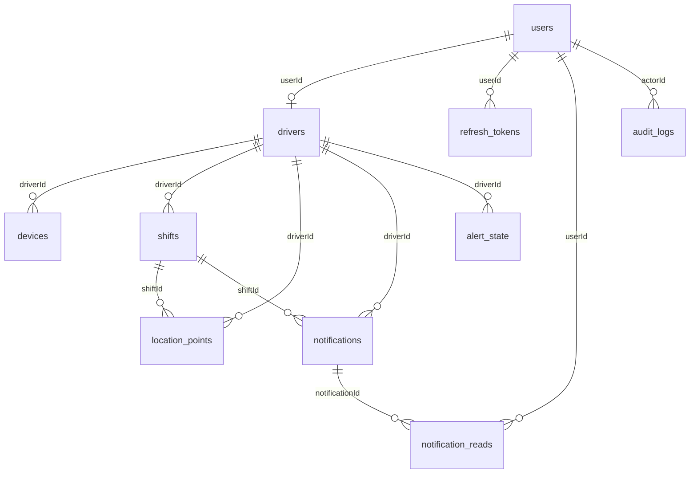

# TRACKER — DATA & API CONTRACT SPECIFICATION

## 1. ENTITY-RELATIONSHIP MODEL



---

## 2. CORE DATABASE SCHEMA DEFINITIONS

### 2.1 `users`
- `id`: UUID (Primary Key)
- `name`: TEXT NOT NULL
- `email`: TEXT NOT NULL UNIQUE (Case-insensitive normalized)
- `phone`: TEXT NULL UNIQUE
- `passwordHash`: TEXT NOT NULL
- `role`: ENUM ('ADMIN', 'CALL_CENTER', 'DRIVER') NOT NULL
- `active`: BOOLEAN NOT NULL DEFAULT true
- `createdAt`: TIMESTAMPTZ NOT NULL DEFAULT now()
- `updatedAt`: TIMESTAMPTZ NOT NULL DEFAULT now()

### 2.2 `drivers`
- `id`: UUID (Primary Key)
- `userId`: UUID NOT NULL UNIQUE (FK -> users.id, CASCADE DELETE)
- `employeeId`: TEXT NOT NULL UNIQUE
- `active`: BOOLEAN NOT NULL DEFAULT true
- `createdAt`: TIMESTAMPTZ NOT NULL DEFAULT now()
- `updatedAt`: TIMESTAMPTZ NOT NULL DEFAULT now()

### 2.3 `devices`
- `id`: UUID (Primary Key)
- `driverId`: UUID NOT NULL (FK -> drivers.id, CASCADE DELETE)
- `platform`: TEXT NOT NULL ('ANDROID', 'IOS', 'WEB')
- `deviceIdentifier`: TEXT NULL
- `appVersion`: TEXT NULL
- `lastSeen`: TIMESTAMPTZ NULL (Heartbeat / HTTP freshness)
- `lastLocationAt`: TIMESTAMPTZ NULL (GPS fix freshness)
- `authorized`: BOOLEAN NOT NULL DEFAULT false
- `batteryPercentage`: INTEGER NULL
- `isCharging`: BOOLEAN NOT NULL DEFAULT false
- `locationServicesEnabled`: BOOLEAN NOT NULL DEFAULT true
- `networkStatus`: TEXT NOT NULL DEFAULT 'unknown'

### 2.4 `shifts`
- `id`: UUID (Primary Key)
- `driverId`: UUID NOT NULL (FK -> drivers.id, CASCADE DELETE)
- `startedAt`: TIMESTAMPTZ NOT NULL DEFAULT now()
- `endedAt`: TIMESTAMPTZ NULL
- `status`: ENUM ('ACTIVE', 'COMPLETED') NOT NULL
- Partial Unique Index: Only ONE active shift per driver (`status = 'ACTIVE'`).

### 2.5 `location_points`
- `id`: UUID (Primary Key)
- `driverId`: UUID NOT NULL (FK -> drivers.id, CASCADE DELETE)
- `shiftId`: UUID NULL (FK -> shifts.id, SET NULL)
- `clientLocationId`: TEXT NULL (Unique per driver for idempotent deduplication)
- `latitude`: DOUBLE PRECISION NOT NULL (-90 to 90)
- `longitude`: DOUBLE PRECISION NOT NULL (-180 to 180)
- `accuracy`: DOUBLE PRECISION NULL (Meters)
- `altitude`: DOUBLE PRECISION NULL
- `speed`: DOUBLE PRECISION NULL (m/s)
- `heading`: DOUBLE PRECISION NULL (0 to 360 degrees)
- `recordedAt`: TIMESTAMPTZ NOT NULL
- `receivedAt`: TIMESTAMPTZ NOT NULL DEFAULT now()
- `source`: TEXT NOT NULL DEFAULT 'mobile'

### 2.6 `audit_logs` (Phase 5)
- `id`: UUID (Primary Key)
- `actorId`: UUID NULL (FK -> users.id, SET NULL)
- `actorEmail`: TEXT NOT NULL
- `actorRole`: TEXT NOT NULL
- `action`: TEXT NOT NULL
- `entityType`: TEXT NOT NULL
- `entityId`: TEXT NOT NULL
- `details`: TEXT NULL (JSON payload, strictly sanitized)
- `ipAddress`: TEXT NULL
- `createdAt`: TIMESTAMPTZ NOT NULL DEFAULT now()

---

## 3. UNIFIED API ENDPOINT CONTRACTS

### 3.1 Historical Data Layer

#### `GET /api/drivers/:id/locations`
- **Auth**: `requireAuth` (`ADMIN`, `CALL_CENTER`, or own `DRIVER`).
- **Query Params**:
  - `page`: number (default 1)
  - `limit`: number (default 50, max 500)
  - `shiftId`: string UUID (optional)
  - `from`: ISO timestamp string (optional)
  - `to`: ISO timestamp string (optional)
- **Response**:
```json
{
  "page": 1,
  "limit": 50,
  "total": 120,
  "items": [
    {
      "id": "uuid",
      "driverId": "uuid",
      "shiftId": "uuid",
      "latitude": 24.7136,
      "longitude": 46.6753,
      "accuracy": 12.5,
      "altitude": 612.0,
      "speed": 6.2,
      "heading": 180.0,
      "recordedAt": "2026-09-30T19:00:00.000Z",
      "receivedAt": "2026-09-30T19:00:02.000Z",
      "operationalStatus": "MOVING"
    }
  ]
}
```

#### `GET /api/drivers/:id/shifts`
- **Auth**: `requireAuth` (`ADMIN`, `CALL_CENTER`, or own `DRIVER`).
- **Query Params**:
  - `page`: number (default 1)
  - `limit`: number (default 10)
  - `status`: `'ACTIVE' | 'COMPLETED'` (optional)
  - `from`: ISO timestamp string (optional)
  - `to`: ISO timestamp string (optional)
- **Response**:
```json
{
  "page": 1,
  "limit": 10,
  "total": 15,
  "items": [
    {
      "id": "uuid",
      "driverId": "uuid",
      "status": "COMPLETED",
      "startedAt": "2026-09-30T10:00:00.000Z",
      "endedAt": "2026-09-30T18:00:00.000Z",
      "durationMinutes": 480
    }
  ]
}
```

#### `GET /api/drivers/:id/activity`
- **Auth**: `requireAuth` (`ADMIN`, `CALL_CENTER`, or own `DRIVER`).
- **Query Params**:
  - `shiftId`: string UUID (optional, defaults to active/latest shift)
  - `page`: number (default 1)
  - `limit`: number (default 50)
- **Response**:
```json
{
  "page": 1,
  "limit": 50,
  "total": 6,
  "items": [
    {
      "id": "act-1",
      "type": "SHIFT_STARTED",
      "timestamp": "2026-09-30T10:00:00.000Z",
      "latitude": 24.7136,
      "longitude": 46.6753,
      "metadata": { "shiftId": "uuid" }
    },
    {
      "id": "act-2",
      "type": "LEFT_RESTAURANT",
      "timestamp": "2026-09-30T10:15:00.000Z",
      "latitude": 24.7155,
      "longitude": 46.6780,
      "metadata": { "distanceMeters": 210 }
    },
    {
      "id": "act-3",
      "type": "MOVING",
      "timestamp": "2026-09-30T10:16:00.000Z",
      "latitude": 24.7160,
      "longitude": 46.6790,
      "metadata": { "speedKmh": 28 }
    },
    {
      "id": "act-4",
      "type": "STOPPED",
      "timestamp": "2026-09-30T10:30:00.000Z",
      "latitude": 24.7300,
      "longitude": 46.6900,
      "metadata": {}
    }
  ]
}
```

---

### 3.2 Reports & Analytics API

#### `GET /api/reports/summary`
- **Auth**: `requireAuth`, `requireRole('ADMIN', 'CALL_CENTER')`.
- **Query Params**:
  - `from`: ISO timestamp string (required)
  - `to`: ISO timestamp string (required)
  - `driverId`: string UUID (optional)
- **Response**:
```json
{
  "summary": {
    "from": "2026-09-01T00:00:00.000Z",
    "to": "2026-09-30T23:59:59.000Z",
    "totalShifts": 42,
    "totalDurationMinutes": 18450,
    "totalDistanceMeters": 352100,
    "movingDurationMinutes": 9800,
    "stoppedDurationMinutes": 4200,
    "restaurantDurationMinutes": 4450,
    "alertCount": 8
  },
  "drivers": [
    {
      "driverId": "uuid",
      "driverName": "Ahmed",
      "employeeId": "DRV-101",
      "totalShifts": 20,
      "totalDurationMinutes": 9000,
      "totalDistanceMeters": 180000,
      "movingDurationMinutes": 5000,
      "stoppedDurationMinutes": 2000,
      "restaurantDurationMinutes": 2000,
      "alertCount": 3
    }
  ]
}
```

---

### 3.3 Centralized Audit Logs API

#### `GET /api/audit-logs`
- **Auth**: `requireAuth`, `requireRole('ADMIN')`.
- **Query Params**:
  - `page`: number (default 1)
  - `limit`: number (default 20, max 100)
  - `action`: string (optional)
  - `entityType`: string (optional)
  - `actorId`: string UUID (optional)
  - `from`: ISO date (optional)
  - `to`: ISO date (optional)
- **Response**:
```json
{
  "page": 1,
  "limit": 20,
  "total": 35,
  "items": [
    {
      "id": "uuid",
      "actorId": "uuid",
      "actorEmail": "admin@tracker.local",
      "actorRole": "ADMIN",
      "action": "DEVICE_RESET",
      "entityType": "DEVICE",
      "entityId": "dev-uuid",
      "details": { "driverId": "driver-uuid", "reason": "Admin initiated reset" },
      "ipAddress": "192.168.1.100",
      "createdAt": "2026-09-30T18:45:00.000Z"
    }
  ]
}
```

---

### 3.4 Telemetry Diagnostics & Connection Model

The shared client telemetry resolver produces:
```ts
export interface TelemetryDiagnostics {
  connectionState: 'ONLINE' | 'OFFLINE';
  gpsQuality: 'FRESH' | 'STALE' | 'DEGRADED' | 'UNAVAILABLE';
  operationalStatus: 'AT_RESTAURANT' | 'MOVING' | 'STOPPED' | 'OFFLINE' | 'AWAITING';
  syncStatus: 'SYNCING' | 'SYNCED';
  speedSemantics: {
    speedKmh: number | null;
    isCurrent: boolean;
    isHistorical: boolean;
    ageMinutes: number | null;
  };
}
```
Rules:
- `connectionState`: Strictly evaluates `lastSeen <= offlineGraceMinutes`.
- `gpsQuality`:
  - `UNAVAILABLE`: No GPS fix exists.
  - `DEGRADED`: Accuracy > 35m.
  - `STALE`: Fix age > 5 minutes.
  - `FRESH`: Accuracy <= 35m and Fix age <= 5 minutes.
- `operationalStatus`: Taken directly from backend authority (`evaluateOperationalHistory`).
- `syncStatus`: `SYNCING` if mobile SQLite queue > 0; otherwise `SYNCED`.
