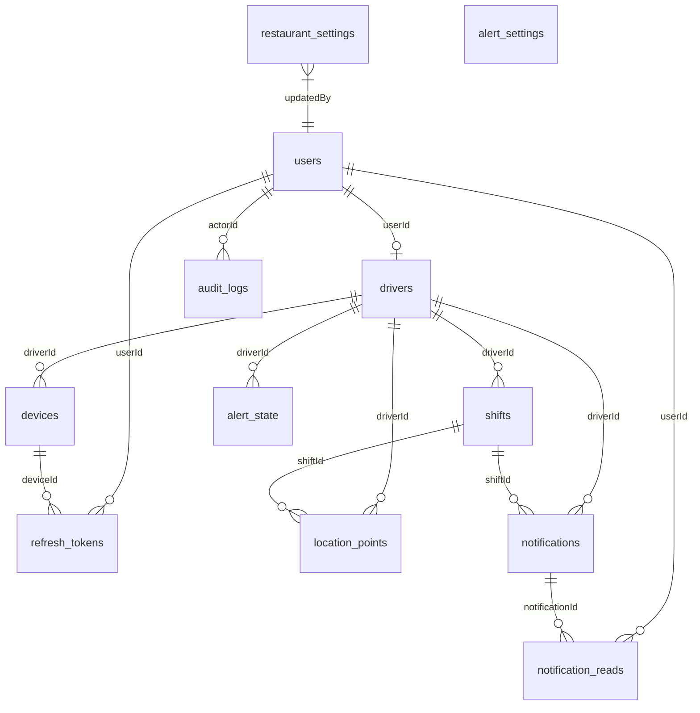

# Database Schema & Data Model

> Authoritative Single Source of Truth for the Tracker Database Model and Relationships.  
> Verified against Drizzle ORM schema definitions and PostgreSQL migrations 0000–0010 (`v1.2.0`).

---

## 1. Entity-Relationship Overview

The database is built on PostgreSQL and managed via Drizzle ORM (`lib/db/src/schema/index.ts`). It contains 12 core tables:

---

## 2. Table Specifications

### 2.1 `users`
Core user identity for all personas (`ADMIN`, `DRIVER`, `CALL_CENTER`).
- `id` (`UUID`, Primary Key, `defaultRandom()`)
- `name` (`TEXT`, Not Null)
- `email` (`TEXT`, Not Null, Unique)
- `phone` (`TEXT`, Nullable)
- `password_hash` (`TEXT`, Not Null, Format `salt:hexKey`)
- `role` (`user_role` Enum: `'ADMIN'`, `'DRIVER'`, `'CALL_CENTER'`)
- `active` (`BOOLEAN`, Not Null, Default `true`)
- `created_at` (`TIMESTAMPTZ`, Not Null, Default `now()`)
- `updated_at` (`TIMESTAMPTZ`, Not Null, Default `now()`)
- *Indexes*: `users_email_idx` (Unique), `users_role_idx`.

### 2.2 `drivers`
Driver operational profile linked 1:1 with `users`.
- `id` (`UUID`, Primary Key)
- `user_id` (`UUID`, Not Null, Unique, FK `users.id` `ON DELETE CASCADE`)
- `employee_id` (`TEXT`, Not Null, Unique, e.g. `DRV-101`)
- `active` (`BOOLEAN`, Not Null, Default `true`)
- `created_at`, `updated_at` (`TIMESTAMPTZ`)
- *Indexes*: `drivers_employee_id_idx` (Unique).

### 2.3 `devices`
Physical hardware bindings and telemetry health indicators.
- `id` (`UUID`, Primary Key)
- `driver_id` (`UUID`, Not Null, FK `drivers.id` `ON DELETE CASCADE`)
- `platform` (`TEXT`, Not Null, `'ANDROID'`)
- `device_identifier` (`TEXT`, Hardware Android ID)
- `app_version` (`TEXT`, e.g. `'1.2.0'`)
- `last_seen` (`TIMESTAMPTZ`, Keepalive presence)
- `last_location_at` (`TIMESTAMPTZ`, Valid GPS fix presence)
- `authorized` (`BOOLEAN`, Not Null, Default `false`)
- `battery_percentage` (`INTEGER`, Nullable)
- `is_charging` (`BOOLEAN`, Not Null, Default `false`)
- `location_services_enabled` (`BOOLEAN`, Not Null, Default `true`)
- `network_status` (`TEXT`, Not Null, Default `'unknown'`)
- `created_at`, `updated_at` (`TIMESTAMPTZ`)
- *Constraints*:
  - `devices_driver_one_authorized_idx`: Unique partial index on `(driver_id)` where `authorized = true`.
  - `devices_driver_platform_identifier_idx`: Unique on `(driver_id, platform, device_identifier)`.

### 2.4 `shifts`
Driver duty sessions and work windows.
- `id` (`UUID`, Primary Key)
- `driver_id` (`UUID`, Not Null, FK `drivers.id` `ON DELETE CASCADE`)
- `startedAt` (`TIMESTAMPTZ`, Not Null, Default `now()`)
- `endedAt` (`TIMESTAMPTZ`, Nullable)
- `status` (`shift_status` Enum: `'ACTIVE'`, `'COMPLETED'`)
- `created_at`, `updated_at` (`TIMESTAMPTZ`)
- *Constraints*:
  - `shifts_driver_active_unique`: Unique partial index on `(driver_id)` where `status = 'ACTIVE'`. Enforces at most 1 open shift per driver.

### 2.5 `refresh_tokens`
Durable session tokens with cryptographic hashing.
- `id` (`UUID`, Primary Key)
- `user_id` (`UUID`, Not Null, FK `users.id` `ON DELETE CASCADE`)
- `token_hash` (`TEXT`, Not Null, Unique, SHA-256 hash of raw JWT)
- `expires_at` (`TIMESTAMPTZ`, Not Null)
- `revoked_at` (`TIMESTAMPTZ`, Nullable)
- `device_id` (`UUID`, Nullable, FK `devices.id` `ON DELETE SET NULL`)
- `created_at` (`TIMESTAMPTZ`)

### 2.6 `location_points`
High-volume raw GPS telemetry stream (retained for 48 hours).
- `id` (`UUID`, Primary Key)
- `driver_id` (`UUID`, Not Null, FK `drivers.id` `ON DELETE CASCADE`)
- `shift_id` (`UUID`, Nullable, FK `shifts.id` `ON DELETE SET NULL`)
- `client_location_id` (`TEXT`, Client-generated UUID string)
- `latitude` (`DOUBLE PRECISION`, Not Null)
- `longitude` (`DOUBLE PRECISION`, Not Null)
- `accuracy` (`DOUBLE PRECISION`, Nullable, meters)
- `altitude` (`DOUBLE PRECISION`, Nullable, meters)
- `speed` (`DOUBLE PRECISION`, Nullable, m/s)
- `heading` (`DOUBLE PRECISION`, Nullable, 0°–360°)
- `recorded_at` (`TIMESTAMPTZ`, Not Null, Hardware GPS timestamp)
- `received_at` (`TIMESTAMPTZ`, Not Null, Server intake timestamp)
- `source` (`TEXT`, Not Null, Default `'mobile'`)
- `created_at` (`TIMESTAMPTZ`)
- *Constraints & Performance Indexes*:
  - `location_points_driver_client_location_unique`: Unique on `(driver_id, client_location_id)` where `client_location_id IS NOT NULL`. Powers idempotent bulk insert (`ON CONFLICT DO NOTHING`).
  - `location_points_driver_recorded_idx`: Composite index on `(driver_id, recorded_at DESC)`.

### 2.7 `restaurant_settings`
Geofence center point and branch parameters.
- `id` (`UUID`, Primary Key)
- `name` (`TEXT`, Not Null, Default `'Main Branch'`)
- `latitude` (`DOUBLE PRECISION`, Default `24.7136`)
- `longitude` (`DOUBLE PRECISION`, Default `46.6753`)
- `radius_meters` (`DOUBLE PRECISION`, Default `150.0`)
- `enabled` (`BOOLEAN`, Not Null, Default `true`)
- `updated_at` (`TIMESTAMPTZ`)
- `updated_by` (`UUID`, FK `users.id`)

### 2.8 `alert_settings`
Fleet operational alert rules and thresholds.
- `id` (`UUID`, Primary Key)
- `max_stop_duration_minutes` (`INTEGER`, Default `10`)
- `offline_grace_minutes` (`INTEGER`, Default `5`)
- `low_battery_threshold` (`INTEGER`, Default `20`)
- `critical_battery_threshold` (`INTEGER`, Default `10`)
- `max_shift_duration_hours` (`INTEGER`, Default `12`)
- `stop_alert_enabled`, `gps_alert_enabled`, `offline_alert_enabled`, `battery_alert_enabled`, `restaurant_geofence_alert_enabled`, `sound_enabled`, `in_app_alerts_enabled` (`BOOLEAN`, Default `true`)
- `push_alerts_enabled` (`BOOLEAN`, Default `false`)

### 2.9 `notifications`
System notifications and operational warnings.
- `id` (`UUID`, Primary Key)
- `type` (`TEXT`, Not Null, e.g. `'GEOFENCE_ENTER'`, `'STOP_EXTENDED'`)
- `severity` (`TEXT`, Default `'INFO'`, `'WARNING'`, `'CRITICAL'`)
- `title_ar`, `title_en`, `message_ar`, `message_en` (`TEXT`, Not Null)
- `driver_id` (`UUID`, Nullable, FK `drivers.id` `ON DELETE CASCADE`)
- `shift_id` (`UUID`, Nullable, FK `shifts.id` `ON DELETE CASCADE`)
- `metadata` (`TEXT`, JSON string)
- `read` (`BOOLEAN`, Default `false`)
- `read_at` (`TIMESTAMPTZ`)
- `resolved` (`BOOLEAN`, Default `false`)
- `resolved_at` (`TIMESTAMPTZ`)
- `created_at` (`TIMESTAMPTZ`, Default `now()`)

### 2.10 `notification_reads`
User-scoped read tracking for dispatchers.
- `id` (`UUID`, Primary Key)
- `notification_id` (`UUID`, Not Null, FK `notifications.id` `ON DELETE CASCADE`)
- `user_id` (`UUID`, Not Null, FK `users.id` `ON DELETE CASCADE`)
- `read_at` (`TIMESTAMPTZ`, Default `now()`)
- *Constraint*: `notification_reads_user_notif_unique` on `(user_id, notification_id)`.

### 2.11 `alert_state`
State tracker for active ongoing conditions (extended stops, low battery).
- `id` (`UUID`, Primary Key)
- `driver_id` (`UUID`, Not Null, FK `drivers.id` `ON DELETE CASCADE`)
- `alert_type` (`TEXT`, Not Null)
- `triggered_at` (`TIMESTAMPTZ`, Default `now()`)
- `resolved_at` (`TIMESTAMPTZ`, Nullable)
- `last_notified_at` (`TIMESTAMPTZ`, Default `now()`)
- `state_data` (`TEXT`)
- *Constraint*: `alert_state_driver_alert_unique` on `(driver_id, alert_type)`.

### 2.12 `audit_logs`
Tamper-evident administrative audit trail with sensitive key masking.
- `id` (`UUID`, Primary Key)
- `actor_id` (`UUID`, FK `users.id` `ON DELETE SET NULL`)
- `actor_email` (`TEXT`, Not Null)
- `actor_role` (`TEXT`, Not Null)
- `action` (`TEXT`, Not Null, e.g. `'DEVICE_RESET'`, `'SHIFT_FORCE_ENDED'`)
- `entity_type` (`TEXT`, Not Null)
- `entity_id` (`TEXT`, Not Null)
- `details` (`TEXT`, Masked JSON payload)
- `ip_address` (`TEXT`)
- `created_at` (`TIMESTAMPTZ`, Default `now()`)
