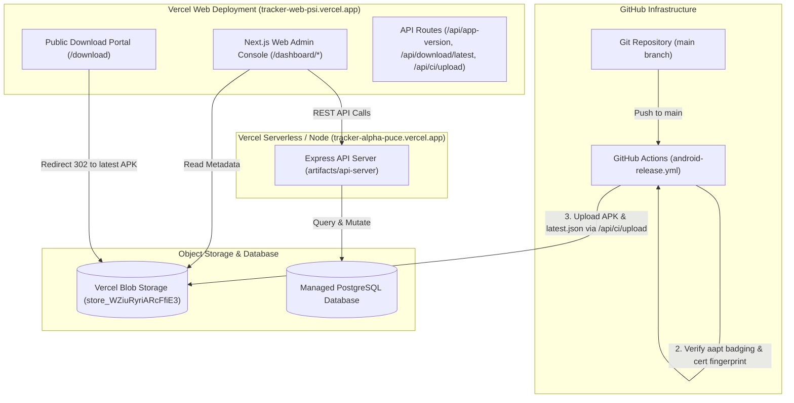

# Production Deployment Architecture

> Authoritative Single Source of Truth for Cloud Deployments, Vercel Blob Storage, and CI/CD Automation.  
> Verified against production GitHub Actions workflows, Vercel configs, and release scripts (`v1.2.0`).

---

## 1. Production Topology

Tracker's production environment comprises four integrated cloud tiers:



---

## 2. Production Services & Endpoints

| Service / Subsystem | Host Platform | Production URL | Primary Role |
| :--- | :--- | :--- | :--- |
| **Web Console & Portal** | Vercel | `https://tracker-web-psi.vercel.app` | Administrative Web dashboard, public `/download` portal, release metadata resolver. |
| **Backend API Server** | Vercel / Node.js | `https://tracker-alpha-puce.vercel.app` | Express API endpoints: authentication, shift lifecycle, telemetry batch ingestion, fleet state machine. |
| **Relational Database** | Managed PostgreSQL | Secure connection string (`DATABASE_URL`) | Drizzle ORM persistence for all 12 system tables. |
| **Release Blob Storage** | Vercel Blob | Store ID `store_WZiuRyriARcFfiE3` | Public binary hosting for signed Android APKs (`Tracker-1.2.0-35.apk`) and `latest.json`. |

---

## 3. GitHub Actions Release Pipeline (`android-release.yml`)

The Android release process is completely automated. Pushing a commit to `main` triggers a rigorous 8-stage verification and deployment pipeline:

1. **Monotonic Versioning**:
   - Computes `VERSION_CODE = GITHUB_RUN_NUMBER + 1`.
   - Injects the new monotonic version code into `version.json`.
2. **Keystore Provisioning**:
   - Decodes `secrets.KEYSTORE_BASE64` into `production.keystore` in the runner workspace.
3. **Release Build**:
   - Executes `./gradlew assembleRelease` using JDK 17 (Zulu) and Android SDK 35 build tools.
4. **Keystore Secure Deletion**:
   - Immediately purges `production.keystore` from runner disk via an `always()` cleanup step.
5. **Cryptographic Signature Verification**:
   - Verifies the APK's certificate SHA-256 fingerprint using Android `apksigner`:
     ```bash
     EXPECTED_FINGERPRINT="fa9d044e9c16e33b9d2e17243bd06def803407d85c79d87b739e24ec0db291d3"
     ```
   - If the certificate fingerprint does not match, the pipeline aborts immediately.
6. **Binary Hash Calculation**:
   - Calculates the SHA-256 checksum and exact file size in bytes of `app-release.apk`.
7. **`aapt` Badging Integrity Audit (`verify-apk.mjs`)**:
   - Runs `aapt dump badging` against the built binary.
   - Asserts that `package`, `versionName`, and `versionCode` embedded in `AndroidManifest.xml` precisely match `version.json`.
8. **Vercel Blob Direct Upload (`publish-release.mjs`)**:
   - Authenticates against `https://tracker-web-psi.vercel.app/api/ci/upload` using constant-time `timingSafeEqual` comparison against `CI_UPLOAD_SECRET`.
   - Streams `Tracker-${version}-${versionCode}.apk` directly into Vercel Blob.
   - Generates and uploads `releases/android/latest.json`.
   - Automatically prunes older APK blobs in Blob storage (retaining the 2 newest versions) to respect storage quotas.

---

## 4. Production Environment Variables

### 4.1 Backend API Server (`artifacts/api-server`)

| Variable | Description | Sensitivity |
| :--- | :--- | :--- |
| `DATABASE_URL` | PostgreSQL connection pooling URL. | Secret |
| `JWT_SECRET` | 256-bit secret for signing access and telemetry tokens. | Secret |
| `JWT_REFRESH_SECRET` | 256-bit secret for signing refresh tokens. | Secret |
| `CORS_ALLOWED_ORIGINS` | Comma-separated allowed browser domains (e.g. `https://tracker-web-psi.vercel.app`). | Public |
| `PORT` | Local listen port (default `3000`). | Configuration |
| `BLOB_READ_WRITE_TOKEN`| Access token for Vercel Blob queries. | Secret |

### 4.2 Web Administrative App (`apps/web`)

| Variable | Description | Sensitivity |
| :--- | :--- | :--- |
| `NEXT_PUBLIC_API_URL` | Base URL of the backend API server. | Public |
| `BLOB_READ_WRITE_TOKEN`| Token enabling Next.js API routes to list and stream APK blobs. | Secret |
| `BLOB_STORE_ID` | Vercel Blob store identifier (`store_WZiuRyriARcFfiE3`). | Public |
| `CI_UPLOAD_SECRET` | Pre-shared key authenticating GitHub Actions release uploads. | Secret |
| `TRACKER_APK_DOWNLOAD_URL` | Optional static CDN override for APK downloads. | Public |

### 4.3 Mobile Application (`apps/mobile`)

| Variable | Description | Sensitivity |
| :--- | :--- | :--- |
| `EXPO_PUBLIC_API_URL` | Production API endpoint (`https://tracker-alpha-puce.vercel.app`). | Public |
| `EXPO_PUBLIC_LOCATION_INTERVAL_MS` | GPS polling interval (default `5000`). | Configuration |
| `EXPO_PUBLIC_LOCATION_DISTANCE_METERS` | Minimum GPS distance delta (default `10`). | Configuration |
