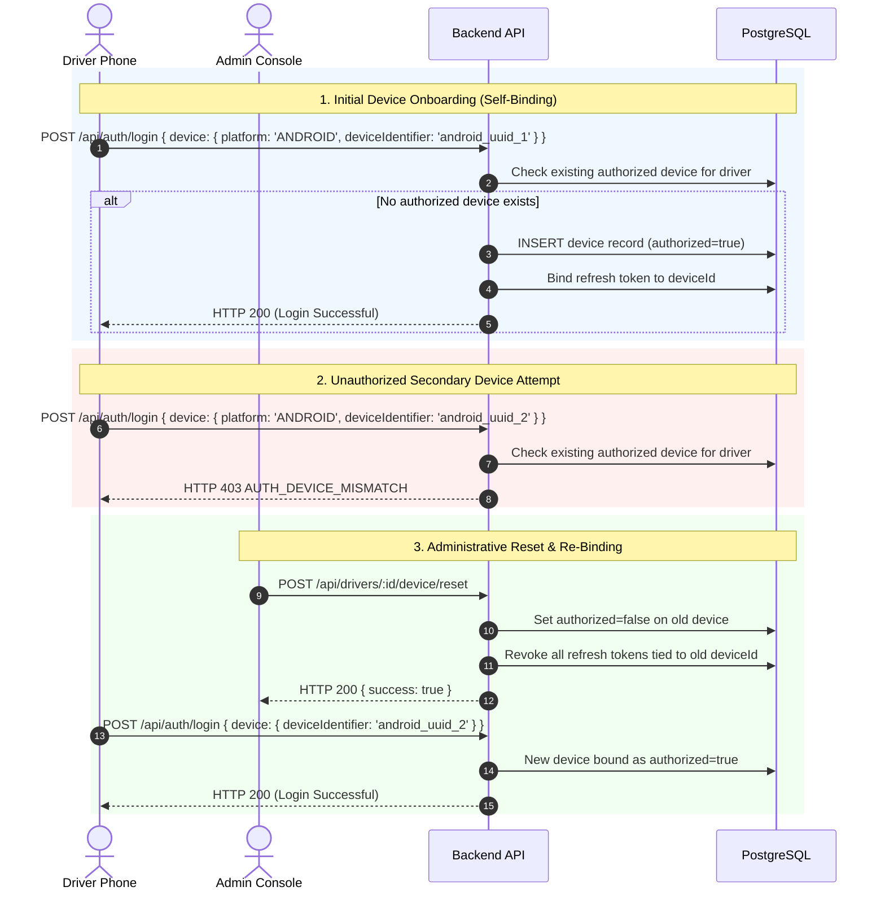

# Device Management Specification

> Practical Single Source of Truth for Driver Hardware Binding, Lifecycle Governance, and Device Telemetry Metadata.  
> Verified against production device tables, auth services, and admin screens (`v1.2.0`).

---

## 1. Device Governance Model

Device Management in Tracker is an administrative security function designed to enforce accountability and prevent proxy clock-ins:

1. **One Driver = One Device**: A driver account is bound to a single physical phone at any given time.
2. **Database Invariant**: A partial unique index in PostgreSQL guarantees that no driver can ever have more than one authorized device:
   ```sql
   CREATE UNIQUE INDEX devices_driver_one_authorized_idx 
   ON devices (driver_id) 
   WHERE authorized = true;
   ```
3. **Administrative Privilege**: Only users with the `ADMIN` role can view all registered devices across the fleet, reset a driver's device binding, or forcibly reassign hardware.

---

## 2. Device Registration & Binding Workflows



---

## 3. Device Telemetry & Health Metadata

The `devices` table records operational telemetry and hardware status sent with every location batch and heartbeat:

| Field | Data Type | Updated By | Description |
| :--- | :--- | :--- | :--- |
| `platform` | `text` | Login / Register | Client operating system (`ANDROID`). |
| `deviceIdentifier` | `text` | Login / Register | Hardware device identifier string. |
| `appVersion` | `text` | Login / Heartbeat | Installed application version (e.g. `1.2.0`). |
| `authorized` | `boolean` | Admin / Login | Authorization status (must be `true` to allow shift start and telemetry). |
| `lastSeen` | `timestamp` | Telemetry & Heartbeat | Timestamp of most recent server contact (network keepalive). |
| `lastLocationAt` | `timestamp` | Telemetry Only | Timestamp of most recent physical GPS coordinate fix. |
| `batteryPercentage`| `integer` | Telemetry & Heartbeat | Current battery level ($0$ to $100\%$). |
| `isCharging` | `boolean` | Telemetry & Heartbeat | Whether device is plugged into AC/USB power. |
| `locationServicesEnabled` | `boolean` | Telemetry & Heartbeat | Whether Android Location / GPS is toggled ON. |
| `networkStatus` | `text` | Telemetry & Heartbeat | Network connection type (`wifi`, `cellular`, `offline`, `unknown`). |

---

## 4. Administrative Control Operations

### 4.1 Reset Device (`POST /api/drivers/:id/device/reset`)

- **Permissions**: `ADMIN` only.
- **Side Effects**:
  1. Sets `authorized = false` on the driver's current device record.
  2. Revokes all active refresh tokens in `refresh_tokens` associated with that `deviceId`.
  3. Records an audit event (`action: 'DEVICE_RESET'`).
  4. The driver's next session refresh will fail, requiring them to log in again.

### 4.2 Assign Device (`POST /api/drivers/:id/device/assign`)

- **Permissions**: `ADMIN` only.
- **Payload**:
  ```json
  {
    "driverId": "b2f69904-4e78-4392-a160-c3ecb2daea8d",
    "platform": "ANDROID",
    "deviceIdentifier": "android-sec-8842",
    "appVersion": "1.2.0"
  }
  ```
- **Side Effects**:
  1. Atomically unauthorizes and revokes tokens for all previous devices.
  2. Creates or updates the specified device record, setting `authorized = true`.
  3. Records an audit event (`action: 'DEVICE_ASSIGNED'`).
