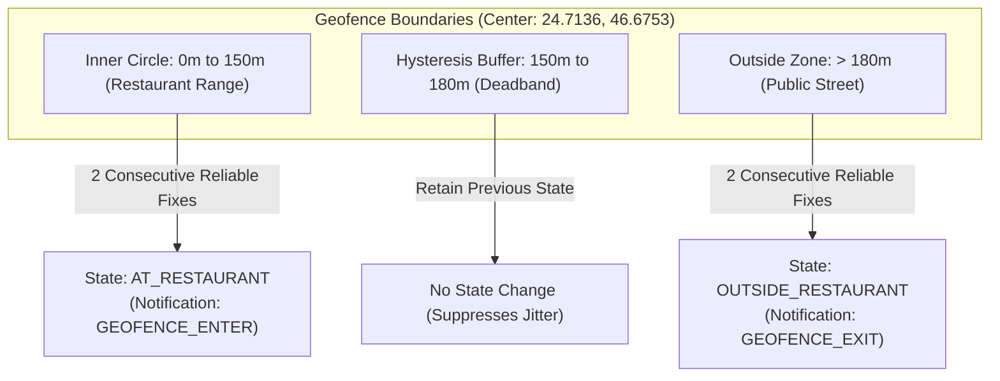
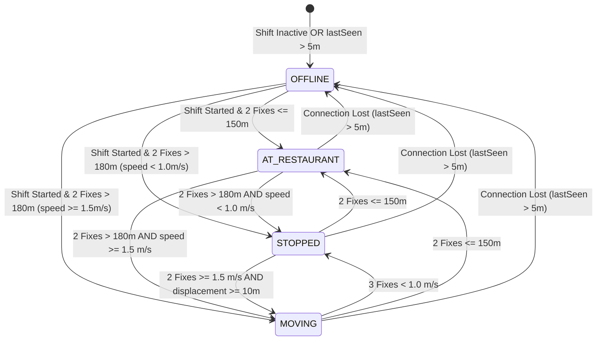

# Geofence & Location Semantics

> Authoritative Single Source of Truth for Geofence Geometries, Operational States, and Confirmation Rules.  
> Verified against production fleet services, alert services, and mobile presentation layers (`v1.2.0`).

---

## 1. Authoritative Geofence Parameters & Thresholds

All geofence and movement algorithms in Tracker are governed by precise, verified constants:

| Threshold / Parameter | Value | Definition | Source File |
| :--- | :--- | :--- | :--- |
| **Default Restaurant Radius** | **`150.0 meters`** | Authoritative default circular radius around restaurant center. Configurable via API/Web (`10m` to `50,000m`). | `settingsService.ts` |
| **Default Restaurant Coordinates** | `24.7136, 46.6753` | Initial branch coordinate seed (Riyadh, KSA). Configurable via Admin. | `settingsService.ts` |
| **Reliable GPS Accuracy** | **`35.0 meters`** | Accuracy ceiling for state transitions. Points with accuracy $> 35\text{m}$ cannot trigger state transitions. | `fleetService.ts` |
| **Geofence Exit Buffer** | **`30.0 meters`** | Hysteresis deadband outside radius ($R + 30\text{m}$) required to confirm restaurant departure. | `fleetService.ts`, `alertService.ts` |
| **Arrival Confirmation** | **`2 samples`** | Number of consecutive reliable GPS fixes $\le \text{radius}$ required to transition to `AT_RESTAURANT`. | `fleetService.ts` |
| **Departure Confirmation** | **`2 samples`** | Number of consecutive reliable GPS fixes $> (\text{radius} + 30\text{m})$ required to transition to `OUTSIDE_RESTAURANT`. | `fleetService.ts` |
| **Movement Speed Threshold** | **`1.5 m/s`** ($5.4\text{ km/h}$) | Speed required to transition from `STOPPED` to `MOVING`. | `fleetService.ts` |
| **Stop Speed Threshold** | **`1.0 m/s`** ($3.6\text{ km/h}$) | Speed ceiling below which movement transitions to `STOPPED`. | `fleetService.ts` |
| **Movement Confirmation** | **`2 samples`** | Consecutive reliable fixes with $\text{speed} \ge 1.5\text{ m/s}$ and $\text{displacement} \ge 10\text{m}$ to enter `MOVING`. | `fleetService.ts` |
| **Stop Confirmation** | **`3 samples`** | Consecutive reliable fixes with $\text{speed} < 1.0\text{ m/s}$ required to enter `STOPPED`. | `fleetService.ts` |
| **Speed Display Accuracy** | **`25.0 meters`** | Accuracy ceiling for speed presentation. If accuracy $> 25\text{m}$, speed displays as 0 km/h. | `fleetService.ts` |
| **Freshness Threshold** | **`5 minutes`** ($300\text{s}$) | GPS age limit. Telemetry older than 5 minutes suppresses speed and enters stale state. | `fleetService.ts` |

---

## 2. Restaurant Geofencing & Hysteresis

To eliminate boundary "flickering" caused by GPS jitter when a driver is sitting near the edge of the restaurant property, Tracker implements **dual-boundary hysteresis with multi-sample confirmation**:

### 2.1 The Two Rules of Geofence Hysteresis

1. **Entering the Restaurant (`GEOFENCE_ENTER`)**:
   - The driver must register **2 consecutive reliable fixes** ($\text{accuracy} \le 35\text{m}$) within the core restaurant radius ($d \le 150\text{m}$).
   - Generates an `INFO` notification: *"Driver arrived at restaurant perimeter"*.
2. **Exiting the Restaurant (`GEOFENCE_EXIT`)**:
   - The driver must register **2 consecutive reliable fixes** beyond the radius plus the hysteresis buffer ($d > 150\text{m} + 30\text{m} = 180\text{m}$).
   - Generates an `INFO` notification: *"Driver left restaurant perimeter"*.
3. **The Deadband Zone ($150\text{m} < d \le 180\text{m}$)**:
   - While in this 30-meter buffer, the driver **retains their existing state**. If they were inside, they remain `AT_RESTAURANT`; if they were outside, they remain `OUTSIDE_RESTAURANT`.

---

## 3. Operational State Machine

The backend computes the canonical operational status for each driver based on shift status, device connection, and recent GPS history window:

### 3.1 State Definitions

| Operational Status | Conditions | UI Presentation | Speed Shown |
| :--- | :--- | :--- | :--- |
| **`OFFLINE`** | No active shift **OR** device `lastSeen` $> 5\text{ minutes}$. | Grey badge / Dimmed icon. | None (`—`). |
| **`AT_RESTAURANT`** | Active shift, device online, inside restaurant geofence. | Purple badge / Home pin. | 0 km/h (Suppressed inside geofence). |
| **`MOVING`** | Active shift, device online, outside geofence, 2 fixes $\ge 1.5\text{ m/s}$ with displacement. | Emerald badge / Pulsing moving icon. | Current speed in km/h ($v \times 3.6$). |
| **`STOPPED`** | Active shift, device online, outside geofence, 3 fixes $< 1.0\text{ m/s}$. | Amber badge / Paused icon. | 0 km/h. |

---

## 4. UI Presentation Invariants

To avoid misleading dispatchers, the frontend implements rigorous presentation invariants (`telemetry.ts`):

1. **`NO_LOCATION` vs. `OUTSIDE_RESTAURANT`**:
   - If a driver starts a shift but has not yet uploaded a valid GPS fix, their state is classified as **`AWAITING`** (*"Awaiting location"*).
   - If a driver is off-shift with zero history, their state is **`NO_LOCATION`** (*"No location data"*).
   - **Invariant**: `NO_LOCATION` must **never** default to `OUTSIDE_RESTAURANT`. Showing a driver as "outside" when zero coordinates exist is strictly forbidden.
2. **Speed Suppression Under Degraded GPS**:
   - Speed is only presented when $\text{accuracy} \le 25\text{m}$ and $\text{age} \le 5\text{ minutes}$.
   - If GPS accuracy degrades to 40m, speed displays as 0 km/h or historical.
3. **Stationary Inside Restaurant**:
   - Extended stop timers (`STOP_EXTENDED`) **never trigger inside the restaurant geofence**. Drivers are expected to wait at the restaurant between deliveries.
