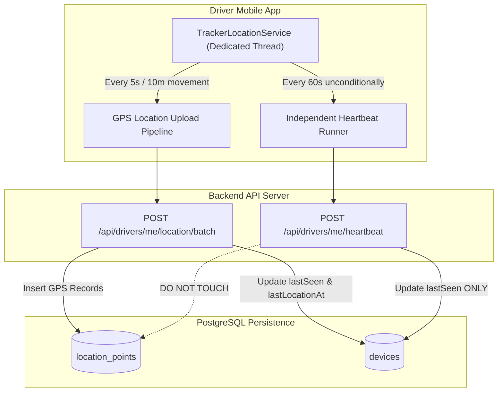

# Device Heartbeat Architecture

> Practical Single Source of Truth for Heartbeat Semantics, Online/Offline Calculation, and Telemetry Separation.  
> Verified against production heartbeat endpoints, native Android runners, and alert evaluators (`v1.2.0`).

---

## 1. Architectural Purpose & Problem Statement

Prior to the introduction of dedicated heartbeats, driver online presence was coupled directly to location telemetry emissions. This created a critical operational defect:

> **The Stationary Driver Dilemma**:  
> When a driver is parked outside waiting for an order or stopped at a long traffic signal, their physical position does not change. Because `FusedLocationProviderClient` filters out micro-movements below 10 meters, zero location points were emitted to the server. Consequently, after 5 minutes of being stationary, the driver was erroneously flagged as **OFFLINE**, despite having a live network connection and an active shift.

The **Device Heartbeat** was introduced as an architecturally distinct keepalive pipeline that uncouples network presence from physical movement.



---

## 2. The Critical Distinction: `lastSeen` vs. `lastLocationAt`

Understanding the difference between these two timestamps is fundamental to interpreting Tracker telemetry:

| Property | Database Column | Updated By | Semantics |
| :--- | :--- | :--- | :--- |
| **Connection Presence** | `devices.lastSeen` | Location batch upload, single location, **AND** 60-second heartbeat. | Confirms the physical phone is powered on, has cellular/Wi-Fi internet access, and is actively communicating with the backend server. |
| **Hardware GPS Fix** | `devices.lastLocationAt` | **ONLY** verified location fixes where `recordedAt > existing lastLocationAt`. | Indicates the timestamp of the latest physical satellite/network coordinate fix. **Never updated by heartbeat**. |

### Why This Separation Matters

1. **Stationary Drivers**: A stationary driver's `lastSeen` remains under 60 seconds, keeping them **ONLINE** on the dispatcher's map, even if `lastLocationAt` is 20 minutes old.
2. **GPS Hardware Fault / Tunnel**: If a driver enters a deep underground parking garage where GPS satellites cannot penetrate, their `lastLocationAt` becomes stale ($> 5\text{m}$). However, if cellular data is available, their heartbeats continue transmitting. The dashboard accurately displays:
   - Status: **ONLINE**
   - GPS Diagnostic: **GPS STALE** (Warning badge)
   - Diagnostic Label: *Device online, awaiting fresh GPS fix*

---

## 3. Native Heartbeat Execution Profile

### 3.1 Cadence & Timing

- **Runner**: Implemented in `TrackerLocationService.kt` via `startHeartbeat(looper: Looper)`.
- **Interval**: **60 seconds** (`HEARTBEAT_INTERVAL_MS = 60_000L`).
- **Initial Ignition**: An initial heartbeat is dispatched **5 seconds** after service startup to immediately confirm the driver as Online upon shift inception.
- **Dedicated Thread**: Executes on the background `TrackerLocationCallbackThread` looper, ensuring heartbeats fire predictably even when the main Android UI thread is busy rendering maps.

### 3.2 Payload Structure

```http
POST /api/drivers/me/heartbeat HTTP/1.1
Host: tracker-alpha-puce.vercel.app
Authorization: Bearer <telemetryToken>
Content-Type: application/json
x-device-id: 573b2229-ffc1-4ebc-9d62-d33a7638361b

{
  "shiftId": "f7d383b1-8b77-4b7b-9f93-5eb7843818e6",
  "batteryPercentage": 82,
  "isCharging": false,
  "locationServicesEnabled": true,
  "networkStatus": "cellular"
}
```

---

## 4. Backend Processing & Side Effects

When `POST /api/drivers/me/heartbeat` arrives at the API server (`authService.ts:1019`):

1. **Authentication Check**: Accepts standard access tokens or scoped telemetry tokens (`requireAuthOrTelemetry`). Verifies the driver is active and the device is authorized.
2. **Shift Verification**: Validates that the driver has an active shift matching the token's `shiftId`.
3. **Device Record Mutation**:
   ```typescript
   await db
     .update(devicesTable)
     .set({
       lastSeen: now,
       updatedAt: now,
       batteryPercentage: input.batteryPercentage,
       isCharging: input.isCharging,
       locationServicesEnabled: input.locationServicesEnabled,
       networkStatus: input.networkStatus,
     })
     .where(eq(devicesTable.id, authorizedDevice[0].id));
   ```
4. **Extended Stop Alert Evaluation**:
   - Because a stationary driver does not upload new location points, the heartbeat runner loads the driver's latest known location and calls `evaluateDriverAlerts`.
   - This ensures that if a driver is stopped outside the restaurant for longer than `maxStopDurationMinutes` (default 10 minutes), the `STOP_EXTENDED` warning triggers reliably even if zero movement occurs.
5. **Response**: Returns lightweight JSON: `{ "ok": true, "serverTime": "2026-10-02T22:30:00.000Z" }`.
