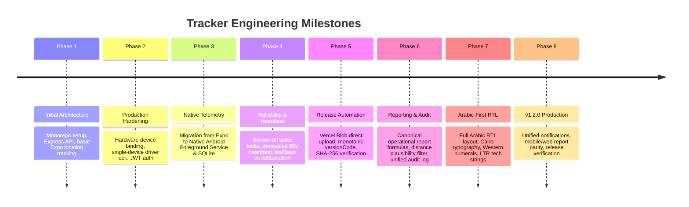

# Project History & Technical Evolution

This document traces the architectural evolution and engineering milestones of Tracker from its initial prototype to the current production v1.2.0 platform.

---

## Technical Evolution Milestones

---

### Phase 1: Prototype to Production Foundation (v1.0.0 – v1.0.4)
- **Baseline**: Set up monorepo with `apps/mobile` (Expo/React Native), `apps/web` (Next.js 14 App Router), and `artifacts/api-server` (Express.js).
- **Core Entities**: Introduced PostgreSQL data model with `users`, `drivers`, `devices`, `shifts`, and `location_points`.
- **Hardware Authorization**: Established single-device binding for drivers to prevent unauthorized phone sharing or ghost tracking.

### Phase 2: Telemetry Hardening & Queue Idempotency (v1.0.5 – v1.0.7)
- **Challenge**: Early mobile prototypes suffered from dropped points when switching between cellular towers or when the app went to the background.
- **Remediation**:
  - Implemented `clientLocationId` on every GPS point.
  - Added PostgreSQL `ON CONFLICT (client_location_id) DO NOTHING` for deduplication.
  - Introduced 24-hour scoped telemetry credentials (`type: 'telemetry'`) to prevent token expiration during multi-hour shifts.

### Phase 3: Native Android Foreground Service Migration (v1.0.8)
- **Crucial Architecture Pivot**: Replaced Expo's high-level background location task with a dedicated **Native Android Kotlin Module** (`apps/mobile/android/app/src/main/java/com/tracker/driver/telemetry/`):
  - `LocationTrackingService.kt`: Android Foreground Service with type `location` and partial wake lock.
  - `FusedLocationProviderClient`: High-accuracy satellite and network provider.
  - `DurableLocationQueue.kt`: Local SQLite database (`tracker_telemetry.db`) buffering up to 1,000 points.
  - `TelemetryUploader.kt`: Resilient native background uploader batching 20 points per HTTP request.
- **Outcome**: Achieved zero data loss through network drops, tunnel traversal, or app backgrounding.

### Phase 4: Shift Geofencing & Admin Force-End (v1.1.0 – v1.1.1)
- **Business Rule Enforcement**:
  - Enforced that drivers cannot start a shift unless physically within 150m of the restaurant dispatch center with reliable GPS (<35m accuracy).
  - Implemented Admin **"Force End Shift"** capability to resolve stuck shifts if a driver's phone battery died or was lost in the field.

### Phase 5: Decoupled Device Heartbeat & OEM Power Hardening (v1.1.2 – v1.1.4)
- **The "Stuck Driver" Problem**: Drivers waiting at the restaurant or stuck in traffic stopped generating movement GPS points, causing early UI versions to falsely mark them "Offline".
- **Remediation**:
  - Created an independent **Heartbeat Pipeline** (`POST /api/heartbeat`, 60s interval).
  - Explicitly separated `lastSeen` (device network connection freshness) from `lastLocationAt` (GPS satellite fix freshness).
  - Hardened screen-off callbacks on aggressive OEM power managers (Samsung OneUI, Xiaomi MIUI) using wake locks and foreground service priority.

### Phase 6: Release Pipeline & Vercel Blob Distribution (v1.1.5 – v1.1.6)
- **Distribution Hardening**:
  - Migrated APK binary distribution to **Vercel Blob Storage** (`releases/android/`).
  - Implemented CI/CD release workflow in GitHub Actions (`.github/workflows/android-release.yml`).
  - Added automated APK verification (`verify-apk.mjs`) using `aapt dump badging` and SHA-256 certificate fingerprint verification (`apksigner`).
  - Created public `/download` portal with QR code and binary proxy streaming.

### Phase 7: Operational Reports & Audit Consolidation (v1.1.7)
- **Metrics Parity**:
  - Consolidated shift reporting formulas into `generateOperationalReport()`.
  - Added physical distance plausibility filter ($\le 150$ km/h cutoff) to eliminate GPS teleportation jumps.
  - Built comprehensive audit logging system (`audit_logs`) tracking 15 administrative and security actions with sensitive field redaction.

### Phase 8: Arabic-First UI/UX & Mobile Parity (v1.1.8 – v1.1.9)
- **Localization**:
  - Converted the entire mobile and web UI to an **Arabic-First RTL** design system.
  - Integrated Cairo Google Font typography with carefully scaled line-heights to eliminate Arabic character clipping.
  - Preserved LTR formatting for technical strings (UUIDs, coordinates, URLs, hashes) and Western Arabic numerals (`1, 2, 3`).

### Phase 9: Unified Notifications & Production Release (v1.2.0 / Code 35)
- **Final Consolidation**:
  - Consolidated alerting into a single unified `notifications` architecture across Web Admin, Mobile Admin, and Mobile Driver.
  - Deprecated legacy separate Alert Center in favor of user-scoped notification reads (`notification_reads`).
  - Achieved 100% test pass rate across 38 suites (352 tests) and verified clean native release build.

---

## Historical Documentation Archive

Historical audit reports, forensic investigation notes, device parity comparisons, and UI QA matrices created during development are preserved under the [`docs/history/`](file:///c:/Users/Emad/Desktop/Tracker/Tracker/docs/history/) directory:

- **Forensic Investigation Passes**: [`docs/history/forensics/`](file:///c:/Users/Emad/Desktop/Tracker/Tracker/docs/history/forensics/)
- **Real-Device Parity Reports**: [`docs/history/device-parity/`](file:///c:/Users/Emad/Desktop/Tracker/Tracker/docs/history/device-parity/)
- **Visual QA & RTL Audits**: [`docs/history/ui-qa/`](file:///c:/Users/Emad/Desktop/Tracker/Tracker/docs/history/ui-qa/)
