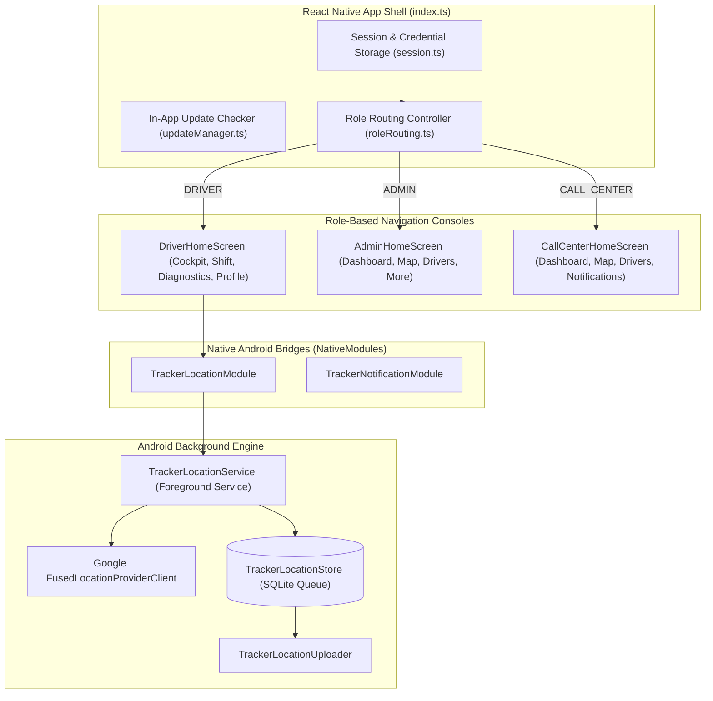

# Mobile Application Architecture

> Practical Single Source of Truth for the Tracker Android / React Native Mobile Application.  
> Verified against production mobile screens, native Kotlin modules, and design tokens (`v1.2.0`).

---

## 1. Overview & Technology Stack

The Tracker mobile app (`apps/mobile`) is an Android-first production application serving drivers, field administrators, and call center dispatchers:

- **Framework**: React Native 0.79 with Expo 53.
- **Native Android Layer**: Custom Kotlin foreground service, SQLite durable queue, and Google Play Services `FusedLocationProviderClient`.
- **Target OS**: Android 8.0+ (API level 26 through 35).
- **Package Name**: `com.tracker.driver`.
- **Current Version**: `v1.2.0` (`versionCode: 35`).
- **Design Language**: Custom high-contrast operational design system with native Arabic RTL support and Cairo typography.

---

## 2. Role-Based Screen Architecture

### 2.1 Driver Cockpit (`DriverHomeScreen`)

The Driver Cockpit provides immediate, single-glance clarity to 5 vital operational questions without cognitive overload:

1. *Am I actively on shift?* (Shift status indicator).
2. *Is my location being tracked right now?* (Live tracking pulse).
3. *Is my GPS signal accurate?* (GPS reliability badge: Reliable vs. Degraded).
4. *Is my device connected to the server?* (Online vs. Offline network pill).
5. *Do I have unsynced points stored offline?* (Local SQLite queue counter).

#### Bottom Navigation Tabs:
- **`cockpit`**: Real-time status cards, current speed, restaurant geofence pill, and quick shift start/end actions.
- **`shift`**: Comprehensive shift management, geofence radius feedback, and historical shift log.
- **`diagnostics`**: Technical health dashboard showing battery percentage, charging state, location permission status, network connection type, and exact SQLite queue backlog.
- **`profile`**: Driver profile details (name, employee ID, bound device ID, installed app version) and sign out.

### 2.2 Mobile Admin Console (`AdminHomeScreen`)

Empowers managers in the field with full operational oversight:

#### Bottom Navigation Tabs:
- **`dashboard`**: Fleet summary KPI tiles, active driver counts, low battery counters.
- **`map`**: Real-time geographic Leaflet map embedded via `react-native-webview`, rendering the restaurant geofence circle and live driver markers.
- **`drivers`**: Searchable driver list with quick actions and full driver detail modals.
- **`more`**: Secondary administrative hub containing sub-views for **Devices**, **Users**, **Settings**, **Notifications**, **Reports**, and **Audit Logs**.

### 2.3 Mobile Call Center Console (`CallCenterHomeScreen`)

A streamlined, strictly read-only console for support agents:
- **`dashboard`**: Live fleet operational stats.
- **`map`**: Real-time driver map for live order tracking.
- **`drivers`**: Driver directory with phone numbers for dispatch communication.
- **`notifications`**: Live alert stream to acknowledge delivery delays and extended stops.

---

## 3. Native Android Kotlin Modules

Tracker bypasses JavaScript execution for background tracking, relying entirely on native Android components (`apps/mobile/android/app/src/main/java/com/tracker/driver/tracking/`):

| Native Class | Responsibility | Key Invariants |
| :--- | :--- | :--- |
| **`TrackerLocationService`** | Android `Service` running in foreground mode. | Shows persistent notification `NOTIFICATION_ID = 9001`. Runs FusedLocation updates on a dedicated `HandlerThread` to avoid UI jank. Filters fixes with accuracy $> 150\text{m}$. |
| **`TrackerLocationStore`** | Local SQLite helper (`tracker_telemetry_queue.db`). | Durable ACID storage. Hard cap of 1,000 records with FIFO eviction. Enforces shift isolation by purging prior-shift points when a new shift starts. |
| **`TrackerLocationUploader`** | Background HTTP batch uploader. | Single-threaded worker that uploads batches of up to 20 points to `/api/drivers/me/location/batch`. Implements exponential retry backoff on failures. |
| **`TrackerLocationModule`** | React Native NativeModule bridge. | Exposes asynchronous Promise methods to TypeScript (`startTracking`, `stopTracking`, `getTrackingStatus`, `getQueueSize`, `getCurrentLocation`). |

---

## 4. In-App Soft Update Pipeline

When a driver launches the application:

1. `updateManager.ts` queries `/api/app-version`.
2. It compares the installed app's `versionCode` against the server's published `versionCode`.
3. If an update is available:
   - A modal (`TrackerUpdateModal`) appears displaying the new version number, file size, and release notes in the user's active language.
   - If the update is flagged as `mandatory` (or installed version is below `minSupportedVersion`), the modal cannot be dismissed.
   - Clicking **Update Now** downloads the APK into local cache via `expo-file-system` and launches the Android package installer via `Intent.ACTION_VIEW` (`application/vnd.android.package-archive`).
