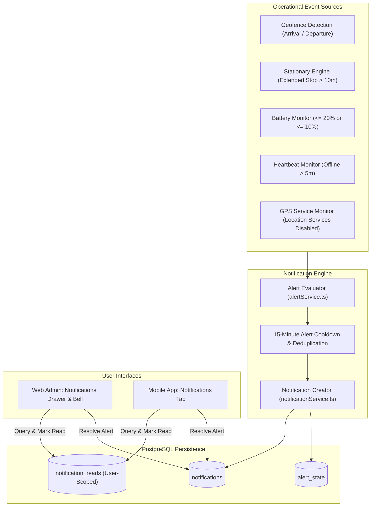

# Notifications Architecture

> Authoritative Single Source of Truth for System Notifications, Operational Alerts, and User-Scoped Read Tracking.  
> Verified against production notification services, alert schedulers, and UI controllers (`v1.2.0`).

---

## 1. Unified Notifications Architecture

Tracker employs a **single, unified notifications pipeline** across both Web and Mobile. All operational triggers (geofence crossings, stationary delays, low battery, device offline, GPS outages) funnel into the central `notifications` table.



> [!IMPORTANT]  
> **Historical Note on "Alert Center"**:  
> Early development iterations contained a standalone "Alert Center" page. This concept was retired and consolidated into the single unified Notifications architecture. Any reference to "Alert Center" in sprint logs is purely historical.

---

## 2. Notification Types & Severity Levels

Every notification record contains bilingual titles and messages (`titleAr`, `titleEn`, `messageAr`, `messageEn`), an operational type, and a severity:

| Notification Type | Severity | Trigger Condition | Auto-Resolution Behavior |
| :--- | :--- | :--- | :--- |
| **`GEOFENCE_ENTER`** | `INFO` | Driver arrives inside restaurant radius ($\le 150\text{m}$) for 2 consecutive reliable fixes. | Non-persistent operational notice. |
| **`GEOFENCE_EXIT`** | `INFO` | Driver leaves restaurant beyond buffer ($> 180\text{m}$) for 2 consecutive reliable fixes. | Non-persistent operational notice. |
| **`STOP_EXTENDED`** | `WARNING` | Driver remains stationary ($< 1.0\text{ m/s}$) outside restaurant for $\ge 10\text{ minutes}$. | Automatically resolved when driver resumes moving or enters restaurant. |
| **`BATTERY_LOW`** | `WARNING` | Device battery percentage drops $\le 20\%$ (`lowBatteryThreshold`). | Automatically resolved when device is charged $> 20\%$. |
| **`BATTERY_CRITICAL`** | `CRITICAL` | Device battery drops $\le 10\%$ (`criticalBatteryThreshold`). | Resolved when device is connected to charger. |
| **`GPS_DISABLED`** | `WARNING` | Driver disables Android Location Services on phone. | Automatically resolved when location permissions are restored. |
| **`OFFLINE`** | `WARNING` | Driver has an active shift but device emits no heartbeats/telemetry for $> 5\text{ minutes}$. | Automatically resolved when driver emits new telemetry or heartbeat. |

---

## 3. Cooldown & Deduplication Mechanics

To prevent spamming dispatchers with dozens of identical alerts during network fluctuations:

1. **Repetitive Alert Cooldown**: `NOTIFICATION_COOLDOWN_MS = 15 * 60 * 1000` (15 minutes). If an extended stop or low battery condition persists, notifications are throttled to at most once every 15 minutes per driver.
2. **Geofence Flip-Flop Cooldown**: `GEOFENCE_TRANSITION_COOLDOWN_MS = 60 * 1000` (60 seconds). Transitions across the geofence perimeter cannot generate more than one event per minute.
3. **Shift Termination Flush**: When a driver ends their shift (or an Admin force-ends it), all unresolved alert records in `alert_state` are marked `resolvedAt = now()`.

---

## 4. User-Scoped Read Tracking (`notification_reads`)

In a multi-user operations center, two dispatchers reading notifications should not interfere with each other's unread badges:

```sql
CREATE TABLE notification_reads (
    id UUID PRIMARY KEY DEFAULT gen_random_uuid(),
    notification_id UUID NOT NULL REFERENCES notifications(id) ON DELETE CASCADE,
    user_id UUID NOT NULL REFERENCES users(id) ON DELETE CASCADE,
    read_at TIMESTAMP WITH TIME ZONE NOT NULL DEFAULT now(),
    CONSTRAINT notification_reads_user_notif_unique UNIQUE (user_id, notification_id)
);
```

- When User A clicks **Mark as Read**, a record is inserted into `notification_reads` for User A.
- User A's unread counter decrements to 0.
- User B still sees the notification as unread until User B reviews it.
- **Legacy Fallback**: The base `notifications.read` and `notifications.readAt` columns are retained to ensure backward compatibility with clients that do not pass a `userId`.

---

## 5. Resolution Workflow

Resolving an alert acknowledges and dismisses the operational warning:

```http
POST /api/notifications/:id/resolve HTTP/1.1
Authorization: Bearer <accessToken>
```

When called:
1. `notifications.resolved` is set to `true` and `resolvedAt` set to `now()`.
2. The notification is automatically marked as read for the resolving user.
3. If the notification is linked to a driver and active alert type, `resolveAlertState(driverId, type)` is invoked to synchronize the driver's live operational status.
