# Tracker Documentation Index

Welcome to the **Tracker** documentation system. This repository documentation represents the authoritative **Single Source of Truth** for the Tracker platform (Release v1.2.0, Version Code 35), verified against current production source code, configuration, API contracts, and database schema.

---

## Documentation Navigation

```mermaid
graph TD
    Root[Tracker Documentation Hub]
    Root --> Start[1. Getting Started]
    Root --> Core[2. Product & Field Operations]
    Root --> Eng[3. Engineering & Architecture]
    Root --> Ops[4. Operations & Maintenance]
    Root --> Hist[5. Historical Archive]

    Start --> Arc[Architecture]
    Start --> Dev[Development]
    Start --> Tree[Project Structure]

    Core --> Roles[Roles & Permissions]
    Core --> Shift[Shift Lifecycle]
    Core --> Tel[Telemetry Pipeline]
    Core --> Geo[Geofence Semantics]
    Core --> HB[Heartbeat]
    Core --> Notif[Notifications]
    Core --> Rep[Reports]
    Core --> DevMgmt[Device Management]
    Core --> Audit[Audit Log]

    Eng --> API[API Reference]
    Eng --> DB[Data Model]
    Eng --> Mob[Mobile App]
    Eng --> Web[Web Admin]
    Eng --> I18n[Localization RTL]
    Eng --> Test[Testing & QA]
    Eng --> Rel[Release Engineering]

    Ops --> Dep[Deployment]
    Ops --> Trb[Troubleshooting]
    Ops --> Lim[System Limitations]
    Ops --> Known[Known Issues]
    Ops --> HistDoc[History & Milestones]
```

---

## 1. Getting Started
- [**Architecture Overview (`ARCHITECTURE.md`)**](file:///c:/Users/Emad/Desktop/Tracker/Tracker/docs/ARCHITECTURE.md): High-level system topology, mobile native pipeline, Web Admin, Express API, database relationships, and Mermaid diagrams.
- [**Local Development Guide (`DEVELOPMENT.md`)**](file:///c:/Users/Emad/Desktop/Tracker/Tracker/docs/DEVELOPMENT.md): Prerequisites (Node, pnpm, JDK 17, Android SDK 35), environment variables, dev servers, and local execution.
- [**Project Structure (`PROJECT_STRUCTURE.md`)**](file:///c:/Users/Emad/Desktop/Tracker/Tracker/docs/PROJECT_STRUCTURE.md): Monorepo directory anatomy, workspace packages, and file responsibilities.
- [**Repository README (`../README.md`)**](file:///c:/Users/Emad/Desktop/Tracker/Tracker/README.md): Polished project overview, core capabilities, and 2-minute quickstart.

---

## 2. Product & Field Operations
- [**Roles & Permissions (`ROLES_AND_PERMISSIONS.md`)**](file:///c:/Users/Emad/Desktop/Tracker/Tracker/docs/ROLES_AND_PERMISSIONS.md): Verified access matrix for `ADMIN`, `CALL_CENTER`, and `DRIVER`.
- [**Driver Shift Lifecycle (`SHIFT_LIFECYCLE.md`)**](file:///c:/Users/Emad/Desktop/Tracker/Tracker/docs/SHIFT_LIFECYCLE.md): Off-shift, shift start with 150m geofence validation, active shift, driver end, and admin force-end workflows.
- [**Telemetry Pipeline (`TELEMETRY.md`)**](file:///c:/Users/Emad/Desktop/Tracker/Tracker/docs/TELEMETRY.md): Android Foreground Service, FusedLocationProvider, 1,000-point SQLite durable queue, batch uploader, and accuracy thresholds.
- [**Geofence & Location Semantics (`GEOFENCE_AND_LOCATION_SEMANTICS.md`)**](file:///c:/Users/Emad/Desktop/Tracker/Tracker/docs/GEOFENCE_AND_LOCATION_SEMANTICS.md): Authoritative 150m restaurant radius, 30m hysteresis buffer, and multi-sample state machine.
- [**Device Heartbeat (`HEARTBEAT.md`)**](file:///c:/Users/Emad/Desktop/Tracker/Tracker/docs/HEARTBEAT.md): Independent 60s ping pipeline, decoupling connection freshness (`lastSeen`) from GPS movement (`lastLocationAt`).
- [**Notifications & Alerts (`NOTIFICATIONS.md`)**](file:///c:/Users/Emad/Desktop/Tracker/Tracker/docs/NOTIFICATIONS.md): Unified notification system, event triggers, auto-resolution rules, and user-scoped read tracking.
- [**Reporting & Analytical Formulas (`REPORTING.md`)**](file:///c:/Users/Emad/Desktop/Tracker/Tracker/docs/REPORTING.md): Mathematical formulas for shift duration, distance plausibility filter ($\le 150$ km/h), moving vs stopped time, and mobile/web parity.
- [**Device Management (`DEVICE_MANAGEMENT.md`)**](file:///c:/Users/Emad/Desktop/Tracker/Tracker/docs/DEVICE_MANAGEMENT.md): Hardware UUID binding, driver single-device lock, pending authorization, and admin reset procedures.
- [**Audit Logging (`AUDIT_LOG.md`)**](file:///c:/Users/Emad/Desktop/Tracker/Tracker/docs/AUDIT_LOG.md): Audited security and administrative events, actor identification, and sensitive field redaction.

---

## 3. Engineering & Architecture
- [**REST API Reference (`API.md`)**](file:///c:/Users/Emad/Desktop/Tracker/Tracker/docs/API.md): Comprehensive reference of all active endpoints, schemas, authentication scopes, and error formats.
- [**Database Data Model (`DATA_MODEL.md`)**](file:///c:/Users/Emad/Desktop/Tracker/Tracker/docs/DATA_MODEL.md): PostgreSQL relational schema, all 12 tables, foreign keys, indexes, and unique constraints.
- [**Mobile Application Architecture (`MOBILE_APP.md`)**](file:///c:/Users/Emad/Desktop/Tracker/Tracker/docs/MOBILE_APP.md): React Native 0.79 / Expo 53, native Kotlin modules, Driver Cockpit HUD, and Mobile Admin experience.
- [**Web Admin Dashboard (`WEB_ADMIN.md`)**](file:///c:/Users/Emad/Desktop/Tracker/Tracker/docs/WEB_ADMIN.md): Next.js 14 App Router, dynamic Leaflet map, dashboard views, and download portal.
- [**Internationalization & RTL Design System (`LOCALIZATION.md`)**](file:///c:/Users/Emad/Desktop/Tracker/Tracker/docs/LOCALIZATION.md): Arabic RTL primary layout, Cairo typography, font scaling, Western Arabic numerals, and LTR technical string rules.
- [**Testing & Quality Assurance (`TESTING.md`)**](file:///c:/Users/Emad/Desktop/Tracker/Tracker/docs/TESTING.md): Automated test suite breakdown (38 suites, 352 passing tests), typechecking, and real-device acceptance validation.
- [**Release Engineering (`RELEASE.md`)**](file:///c:/Users/Emad/Desktop/Tracker/Tracker/docs/RELEASE.md): Monotonic versioning, keystore signing, APK badging verification, Vercel Blob publishing, and soft update flow.

---

## 4. Operations & Maintenance
- [**Production Deployment (`DEPLOYMENT.md`)**](file:///c:/Users/Emad/Desktop/Tracker/Tracker/docs/DEPLOYMENT.md): Production infrastructure topology, Vercel edge deployment, Neon PostgreSQL, environment configurations, and CI/CD pipelines.
- [**Field Troubleshooting Guide (`TROUBLESHOOTING.md`)**](file:///c:/Users/Emad/Desktop/Tracker/Tracker/docs/TROUBLESHOOTING.md): Actionable diagnosis and step-by-step resolution for common real-world operational challenges.
- [**System Boundaries & Limitations (`LIMITATIONS.md`)**](file:///c:/Users/Emad/Desktop/Tracker/Tracker/docs/LIMITATIONS.md): Realistic technical boundaries, OEM battery management, GPS physics, and retention windows.
- [**Known Issues & Audit Findings (`KNOWN_ISSUES.md`)**](file:///c:/Users/Emad/Desktop/Tracker/Tracker/docs/KNOWN_ISSUES.md): Audit findings register, severity ratings, locations, workarounds, and remediation plans.
- [**Technical History & Milestones (`HISTORY.md`)**](file:///c:/Users/Emad/Desktop/Tracker/Tracker/docs/HISTORY.md): Chronological engineering progression from initial prototype to v1.2.0 production release.

---

## 5. Historical Archive
Historical reports, investigation notes, and device QA matrices generated during earlier project iterations are preserved for reference under [`docs/history/`](file:///c:/Users/Emad/Desktop/Tracker/Tracker/docs/history/):
- **Forensic Investigation Passes**: [`docs/history/forensics/`](file:///c:/Users/Emad/Desktop/Tracker/Tracker/docs/history/forensics/)
- **Real-Device Parity Reports**: [`docs/history/device-parity/`](file:///c:/Users/Emad/Desktop/Tracker/Tracker/docs/history/device-parity/)
- **Visual QA & RTL Audits**: [`docs/history/ui-qa/`](file:///c:/Users/Emad/Desktop/Tracker/Tracker/docs/history/ui-qa/)
