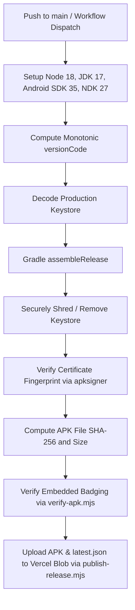
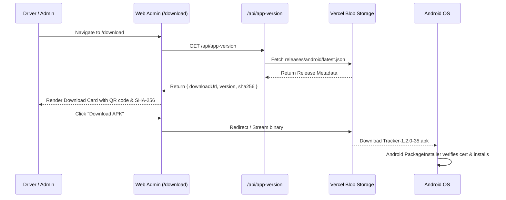

# Release Engineering & Distribution

Tracker uses an automated, reproducible release pipeline for its Android Mobile APK (`com.tracker.driver`) and Web Admin platform. This document defines the versioning scheme, signing requirements, APK identity verification, CI/CD pipeline, and distribution mechanism.

---

## 1. Versioning Scheme & Single Source of Truth

The root configuration file [`version.json`](file:///c:/Users/Emad/Desktop/Tracker/Tracker/version.json) is the **single source of truth** for versioning across the entire repository:

```json
{
  "version": "1.2.0",
  "versionCode": 35,
  "minSupportedVersion": "1.0.0"
}
```

### Components
1. **`version` (`versionName`)**: Semantic version string (`MAJOR.MINOR.PATCH`). Read by:
   - Root release scripts
   - [`apps/mobile/app.config.ts`](file:///c:/Users/Emad/Desktop/Tracker/Tracker/apps/mobile/app.config.ts)
   - [`apps/mobile/android/app/build.gradle`](file:///c:/Users/Emad/Desktop/Tracker/Tracker/apps/mobile/android/app/build.gradle)
   - [`apps/web/app/api/app-version/route.ts`](file:///c:/Users/Emad/Desktop/Tracker/Tracker/apps/web/app/api/app-version/route.ts)
2. **`versionCode`**: Strictly monotonic positive integer (`35`). Android OS prevents installation of any APK with a `versionCode` lower than or equal to the currently installed build.
3. **`minSupportedVersion`**: Semver floor (`1.0.0`) enforced by API and mobile clients to determine if an update is optional or mandatory.

---

## 2. Production APK Identity (v1.2.0 Release)

Every production release build is uniquely identified by five immutable parameters:

| Parameter | Authoritative Value | Verification Tool / Source |
| :--- | :--- | :--- |
| **Package Name** | `com.tracker.driver` | `aapt dump badging` |
| **Version Name** | `1.2.0` | [`version.json`](file:///c:/Users/Emad/Desktop/Tracker/Tracker/version.json) / `aapt dump badging` |
| **Version Code** | `35` | [`version.json`](file:///c:/Users/Emad/Desktop/Tracker/Tracker/version.json) / `aapt dump badging` |
| **Release Certificate SHA-256** | `fa9d044e9c16e33b9d2e17243bd06def803407d85c79d87b739e24ec0db291d3` | `apksigner verify --print-certs` |
| **APK Binary File SHA-256** | `915ea97b0d120b47bcb3376ba16432320dfaedfe883351b4567d5febe76fe21d` | `sha256sum app-release.apk` |
| **Binary File Size** | `70,186,418 bytes` (~`66.9 MB`) | Filesystem stat |

> [!IMPORTANT]
> The release certificate fingerprint ensures update integrity. Android will reject APK installation with `INSTALL_FAILED_UPDATE_INCOMPATIBLE` if an installed app is updated with an APK signed by a different key.

---

## 3. CI/CD Release Pipeline

Automated releases are executed via GitHub Actions in [`.github/workflows/android-release.yml`](file:///c:/Users/Emad/Desktop/Tracker/Tracker/.github/workflows/android-release.yml).

### Pipeline Steps:


### Verification Scripts
1. **`artifacts/api-server/scripts/verify-apk.mjs`**:
   - Executes `aapt dump badging <apk>`
   - Verifies package name is exactly `com.tracker.driver`
   - Verifies `versionName` matches `version.json`
   - Verifies `versionCode` matches `version.json`
   - Exits non-zero immediately on mismatch.
2. **`artifacts/api-server/scripts/publish-release.mjs`**:
   - Streams `Tracker-<version>-<versionCode>.apk` to Vercel Blob store under `releases/android/`
   - Generates release metadata envelope:
     ```json
     {
       "version": "1.2.0",
       "versionCode": 35,
       "minSupportedVersion": "1.0.0",
       "downloadUrl": "https://<blob-store>.public.blob.vercel-storage.com/releases/android/Tracker-1.2.0-35.apk",
       "fileSize": "66.9 MB",
       "sizeBytes": 70186418,
       "sha256": "915ea97b0d120b47bcb3376ba16432320dfaedfe883351b4567d5febe76fe21d",
       "packageName": "com.tracker.driver",
       "filename": "Tracker-1.2.0-35.apk",
       "mandatory": false,
       "releaseNotes": {
         "ar": "تحديث جديد (الإصدار 1.2.0)",
         "en": "New update (v1.2.0)"
       },
       "publishedAt": "2026-10-02T19:30:00.000Z"
     }
     ```
   - Publishes `releases/android/latest.json` to Vercel Blob for dynamic client discovery.

---

## 4. Distribution Architecture



### Public Endpoints:
- **Web Download Page**: [`/download`](file:///c:/Users/Emad/Desktop/Tracker/Tracker/apps/web/app/download/page.tsx)
  - Displays localized Arabic/English installation instructions.
  - Displays Version, File Size, SHA-256 checksum for verification.
  - Renders direct download button and dynamic QR code.
- **Version Discovery API**: `GET /api/app-version`
  - Consumed by both Web UI and Mobile App background update checker.
- **Direct Binary Proxy**: `GET /api/download`
  - Authenticated/public streaming bridge to Vercel Blob storage.

---

## 5. Mobile In-App Soft Update Flow

The mobile app includes an automated update check on launch and screen focus in [`apps/mobile/services/updateService.ts`](file:///c:/Users/Emad/Desktop/Tracker/Tracker/apps/mobile/services/updateService.ts):

1. Queries `GET /api/app-version`.
2. Compares embedded `versionCode` against server `versionCode`.
3. If server `versionCode > installedVersionCode`:
   - Checks if installed version is below `minSupportedVersion`.
   - If below minimum: Shows non-dismissible modal ("Mandatory Update Required").
   - If above minimum: Shows dismissible banner ("New Update Available v1.2.0").
4. Tapping "Update" opens Android system browser to [`/download`](file:///c:/Users/Emad/Desktop/Tracker/Tracker/apps/web/app/download/page.tsx) or downloads the APK directly.

---

## 6. Manual Local Build & Release Verification

To build and verify a release APK locally on Windows:

```powershell
# 1. Ensure version.json is updated
cat version.json

# 2. Build release bundle
cd apps/mobile/android
./gradlew.bat assembleRelease

# 3. Verify signature
$env:ANDROID_HOME/build-tools/35.0.0/apksigner.bat verify --print-certs app/build/outputs/apk/release/app-release.apk

# 4. Verify package & version badging
$env:ANDROID_HOME/build-tools/35.0.0/aapt.exe dump badging app/build/outputs/apk/release/app-release.apk

# 5. Check SHA-256 hash
Get-FileHash app/build/outputs/apk/release/app-release.apk -Algorithm SHA256
```
