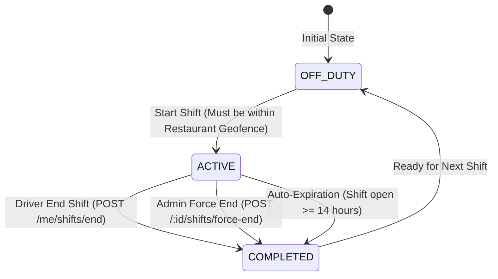
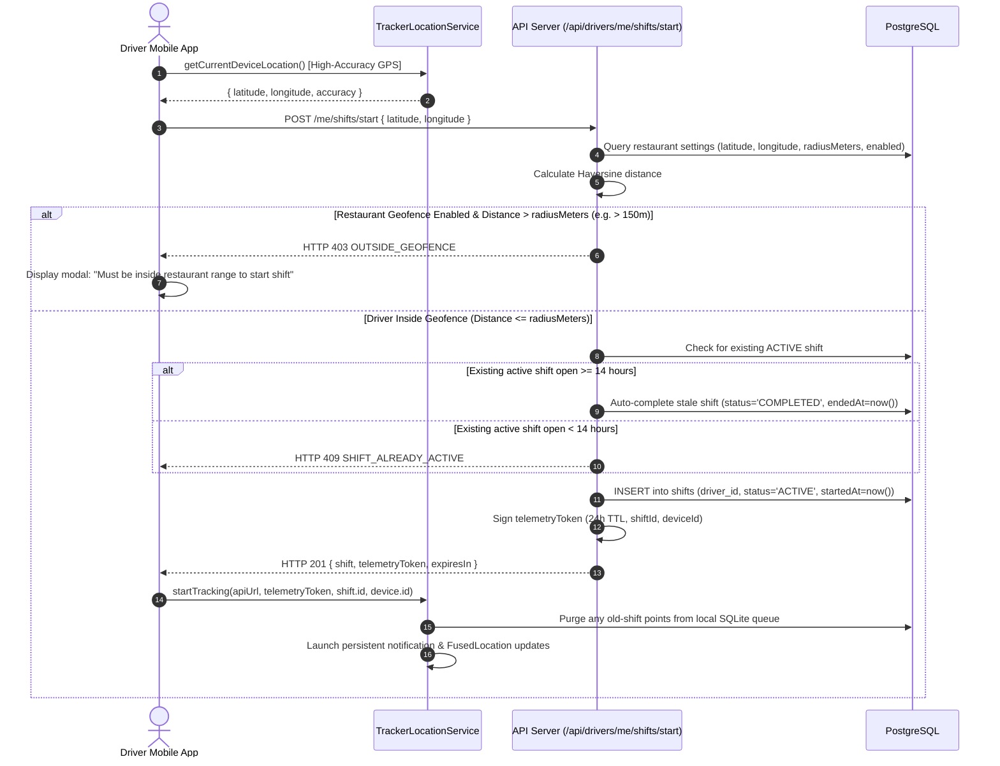

# Driver Shift Lifecycle

> Practical Single Source of Truth for Driver Shifts, Geofence Enforcement, and Termination Semantics.  
> Verified against production shift services, alert resolvers, and mobile controllers (`v1.2.0`).

---

## 1. Shift State Machine

Every driver exists in one of two fundamental shift states within the database schema (`lib/db/src/schema/index.ts`):



| Shift State | Database Representation | Mobile Experience | Fleet Dashboard Visibility | Tracking Service |
| :--- | :--- | :--- | :--- | :--- |
| **OFF_DUTY** | No row with `status = 'ACTIVE'` | Cockpit displays *Off Shift* banner. Shift controls enabled. | Greyed / Inactive in drivers list. Hidden if `activeOnly=true`. | Stopped / Inactive. |
| **ACTIVE** | Row with `status = 'ACTIVE'`, `endedAt IS NULL` | Cockpit shows live tracking metrics, speed, battery, queue. | Colored pin on live map. Computed as `AT_RESTAURANT`, `MOVING`, or `STOPPED`. | Native Android Foreground Service running. |
| **COMPLETED** | Row with `status = 'COMPLETED'`, `endedAt IS NOT NULL` | Returns to *Off Shift* cockpit view. Summary metrics shown. | Status immediately transitions to `OFFLINE`. | Service stopped; remaining queue drained. |

---

## 2. Shift Startup Lifecycle & Geofence Verification

To prevent off-duty surveillance and ensure drivers begin work at the designated operating location, starting a shift requires physical presence inside the restaurant geofence.



---

## 3. Shift Termination Workflows

### 3.1 Driver Normal End Shift (`POST /api/drivers/me/shifts/end`)

When a driver completes their working shift:

1. **Geofence Independence**: Unlike starting a shift, ending a shift **does not require the driver to be inside the restaurant geofence**. A driver can end their shift from any location (e.g., at the end of their last delivery).
2. **Shift Update**: The backend updates the active shift row: `status = 'COMPLETED'`, `endedAt = new Date()`, `updatedAt = new Date()`.
3. **Automatic Alert State Cleanup**: Any lingering alert triggers in `alert_state` (such as `STOP_EXTENDED` or `BATTERY_LOW`) are automatically resolved:
   ```typescript
   await db
     .update(alertStateTable)
     .set({ resolvedAt: new Date() })
     .where(and(eq(alertStateTable.driverId, driver.id), isNull(alertStateTable.resolvedAt)));
   ```
4. **Graceful Mobile Drain**:
   - The mobile app invokes `stopBackgroundTracking(timeoutMs = 8000)`.
   - The native `TrackerLocationService` halts incoming `FusedLocation` updates and stops the 60s heartbeat timer.
   - The native uploader executes a bounded queue drain (up to 8,000ms) to deliver any uncommitted GPS breadcrumbs to PostgreSQL before closing.
   - The persistent foreground notification is removed from the Android status bar.
   - The local telemetry token is erased from secure storage.

### 3.2 Admin Force End Shift (`POST /api/drivers/:id/shifts/force-end`)

If a driver forgets to clock out at the end of the day or leaves their phone behind:

1. An Admin triggers **Force End Shift** via Web (`/dashboard/drivers/[id]`) or Mobile (`AdminHomeScreen -> DriverDetailModal`).
2. The backend immediately marks the shift as `COMPLETED` and resolves all active alerts.
3. An audit record is created (`action: 'SHIFT_FORCE_ENDED'`).
4. **Client-Side Self-Termination**:
   - When the driver's phone next transmits a batched telemetry upload or 60-second heartbeat, the server detects that the shift is no longer active.
   - The server responds with **HTTP 409 `SHIFT_NOT_ACTIVE`**.
   - The mobile app detects this response, halts the foreground service, dismisses the status bar notification, and transitions the cockpit to *Off Shift*.

---

## 4. Shift Queue Isolation Invariant

To guarantee absolute historical reporting accuracy, location telemetry is strictly partitioned by shift:

1. **Database Constraint**: `location_points.shift_id` references `shifts.id` with `ON DELETE SET NULL`.
2. **API Verification**: When a batch upload arrives at `POST /api/drivers/me/location/batch`, the server checks every record's `shiftId`. If any queued point specifies a different `shiftId` than the driver's currently active shift, the request is rejected with **HTTP 409 `SHIFT_MISMATCH`**.
3. **On-Device Purge**: Whenever `TrackerLocationService.startTracking()` is invoked with a new `shiftId`, `TrackerLocationStore.purgeStaleShiftRecords(newShiftId)` purges any pending points belonging to prior shifts from the SQLite queue. Points from Shift A can never be erroneously attributed to Shift B.
