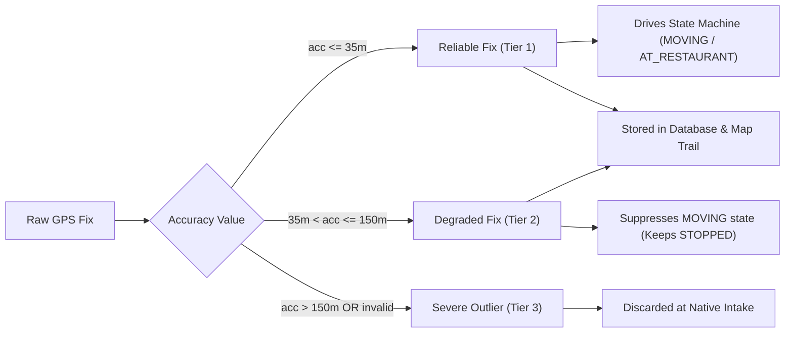

# Telemetry Pipeline Specification

> Practical Single Source of Truth for GPS Telemetry, Ingestion, Queueing, and Invariants.  
> Verified against production native Kotlin modules, backend ingestion routes, and database schemas (`v1.2.0`).

---

## 1. End-to-End Telemetry Pipeline

The Tracker telemetry pipeline captures, verifies, stores, transmits, and persists driver location fixes under harsh mobile conditions:

```
[Driver Mobile UI]
       │
       ▼ (startTracking options)
[TrackerLocationModule (React Native Bridge)]
       │
       ▼
[TrackerLocationService (Native Android Foreground Service)]
  ├── Dedicated HandlerThread (TrackerLocationCallbackThread)
  ├── Google Play Services FusedLocationProviderClient (High Accuracy)
  ├── Severe Accuracy Filter (> 150m rejected)
  └── Monotonic Elapsed Realtime Validator
       │
       ▼ (LocationPointRecord)
[TrackerLocationStore (SQLite Queue: tracker_telemetry_queue.db)]
  ├── 1,000 Record Capacity Cap (FIFO Pruning)
  └── Shift Isolation (Purges prior-shift records)
       │
       ▼ (getPendingBatch: up to 20 records)
[TrackerLocationUploader (Single-Threaded Asynchronous Worker)]
  ├── Exponential Retry Backoff
  └── HttpURLConnection with Telemetry Token
       │
       ▼ (HTTPS POST /api/drivers/me/location/batch)
[Backend Express API Server (artifacts/api-server)]
  ├── Rate Limiter (120 req/min per IP)
  ├── Auth & Shift Token Verification
  └── PostgreSQL Bulk INSERT ON CONFLICT DO NOTHING
       │
       ├── Update devices.lastSeen & devices.lastLocationAt
       └── Asynchronous Rule Evaluation (Geofence, Stop, Battery)
```

---

## 2. Ingestion Parameters & Thresholds

| Parameter | Authoritative Code Value | Source File | Description |
| :--- | :--- | :--- | :--- |
| **GPS Request Interval** | `5,000 ms` (5 seconds) | `TrackerLocationService.kt` | Interval requested from `FusedLocationProviderClient`. |
| **Fastest GPS Interval** | `3,000 ms` (3 seconds) | `TrackerLocationService.kt` | Fastest interval for opportunistic location fixes. |
| **Minimum Distance Delta** | `10.0 meters` | `TrackerLocationService.kt` | Minimum distance between consecutive location updates. |
| **Reliable GPS Accuracy** | `35.0 meters` | `fleetService.ts`, `telemetry.ts` | Threshold for reliable GPS. Only fixes $\le 35\text{m}$ drive operational state transitions. |
| **Severe Accuracy Cutoff** | `150.0 meters` | `TrackerLocationService.kt`, `fleetService.ts` | Fixes with accuracy $> 150\text{m}$ are discarded at native intake. |
| **Speed Accuracy Cutoff** | `25.0 meters` | `fleetService.ts` | Fixes require accuracy $\le 25\text{m}$ to display speed in UI. |
| **Speed Accuracy Audit** | `25.0 m/s` | `TrackerLocationService.kt` | On Android API 26+, `speedAccuracyMetersPerSecond` must be $\le 25\text{m/s}$. |
| **Movement Speed Threshold** | `1.5 m/s` (5.4 km/h) | `fleetService.ts` | Minimum speed to enter `MOVING` state. |
| **Stop Speed Threshold** | `1.0 m/s` (3.6 km/h) | `fleetService.ts` | Maximum speed below which driver enters `STOPPED` state. |
| **Minimum Displacement** | `10.0 meters` | `fleetService.ts` | Required physical displacement between consecutive points to enter `MOVING`. |
| **Geofence Exit Buffer** | `30.0 meters` | `fleetService.ts`, `alertService.ts` | Hysteresis deadband outside restaurant radius to confirm departure. |
| **Batch Size Cap** | `20 records` | `TrackerLocationUploader.kt`, `drivers.ts` | Maximum location points accepted in a single batch upload. |
| **Durable Queue Cap** | `1,000 records` | `TrackerLocationStore.kt` | Maximum on-device SQLite queue capacity before FIFO eviction. |
| **Freshness Lifetime** | `5 minutes` (300s) | `fleetService.ts`, `telemetry.ts` | Locations older than 5 minutes are classified as stale. |
| **Future Timestamp Cutoff** | `+60 seconds` | `authService.ts` | Points with `recordedAt > now + 60s` rejected (HTTP 400). |
| **Past Timestamp Cutoff** | `-24 hours` | `authService.ts` | Points with `recordedAt < now - 24h` rejected (HTTP 400). |
| **Telemetry Retention** | `48 hours` | `retentionService.ts` | Automatic hourly purge of database records older than 48 hours. |

---

## 3. Reliability Classes: Reliable vs. Degraded GPS

A fundamental principle of Tracker is that GPS accuracy is continuous and noisy. Points are classified into three strict tiers:



1. **Reliable Telemetry ($\text{accuracy} \le 35\text{m}$)**:
   - High confidence satellite or fused Wi-Fi/cellular fix.
   - Evaluated by the multi-sample state machine to transition between `AT_RESTAURANT`, `MOVING`, and `STOPPED`.
   - Used for accurate distance integration in shift reports.
2. **Degraded Telemetry ($35\text{m} < \text{accuracy} \le 150\text{m}$)**:
   - Moderate confidence fix (e.g., urban canyon, dense tree cover).
   - Saved to the database and plotted on historical map breadcrumbs so dispatchers know the driver's general vicinity.
   - **Prohibited from triggering `MOVING` transitions**: When accuracy is degraded, operational status defaults to `STOPPED` to prevent fake movement jumps caused by multipath jitter.
   - Operational speed is suppressed to 0 km/h in fleet views.
3. **Severe Outliers ($\text{accuracy} > 150\text{m}$ or missing)**:
   - Cellular tower triangulation or coarse IP geo-estimates.
   - Completely dropped inside `TrackerLocationService.handleNewLocation()`. Never written to SQLite; never sent to the network.

---

## 4. On-Device SQLite Durable Queue

To prevent telemetry loss during cellular dead zones, tunnels, or server maintenance, points are enqueued into a dedicated SQLite database on the Android filesystem:

### 4.1 Schema (`tracker_telemetry_queue.db`)

```sql
CREATE TABLE location_queue (
    id INTEGER PRIMARY KEY AUTOINCREMENT,
    client_location_id TEXT UNIQUE NOT NULL,
    shift_id TEXT,
    latitude REAL NOT NULL,
    longitude REAL NOT NULL,
    accuracy REAL,
    altitude REAL,
    speed REAL,
    heading REAL,
    recorded_at TEXT NOT NULL,
    battery_percentage INTEGER,
    is_charging INTEGER,
    location_services_enabled INTEGER,
    network_status TEXT,
    source TEXT NOT NULL DEFAULT 'mobile',
    created_at INTEGER NOT NULL,
    attempt_count INTEGER NOT NULL DEFAULT 0,
    next_retry_at INTEGER NOT NULL DEFAULT 0
);
CREATE INDEX idx_location_queue_retry ON location_queue (next_retry_at, id);
```

### 4.2 Queue Capacity & FIFO Eviction

- The queue enforces a strict hard ceiling: `MAX_QUEUE_SIZE = 1000`.
- At a 5-second interval, 1,000 points represent approximately **83 minutes of continuous driving without connectivity**.
- If network disconnect exceeds 83 minutes and the queue exceeds 1,000 records, the oldest points are pruned using FIFO ordering (`DELETE FROM location_queue WHERE id IN (SELECT id FROM location_queue ORDER BY id ASC LIMIT toDelete)`).
- This prevents unbounded disk growth and SQLite database bloat.

### 4.3 Idempotency & Deduplication

- Every generated location point is tagged with a client-side UUID:  
  `clientLocationId = "${System.currentTimeMillis()}-${UUID.randomUUID().toString().substring(0, 8)}"`.
- In PostgreSQL, `location_points` enforces a unique index:  
  `location_points_driver_client_location_unique` on `(driver_id, client_location_id)`.
- Ingestion executes via `INSERT INTO location_points ... ON CONFLICT (driver_id, client_location_id) DO NOTHING RETURNING client_location_id`.
- The API response explicitly distinguishes newly inserted IDs from existing duplicates:
  ```json
  {
    "accepted": 18,
    "duplicates": 2,
    "acceptedClientIds": ["id-1", "id-2", ...],
    "duplicateClientIds": ["id-3", "id-4"]
  }
  ```
- The native uploader deletes confirmed records from the local SQLite queue (`deleteConfirmed(acceptedClientIds + duplicateClientIds)`).
- Re-transmissions caused by transient network timeouts can **never produce duplicate records in PostgreSQL**.

---

## 5. Realistic Android OS Behavior & Constraints

Documentation must never make false guarantees about mobile operating systems. The Tracker telemetry service operates under real-world Android constraints:

1. **Foreground Service vs. OEM Battery Managers**:
   - `TrackerLocationService` runs as a foreground service with `ServiceInfo.FOREGROUND_SERVICE_TYPE_LOCATION` and a persistent ongoing notification in the status bar.
   - Under standard Android (AOSP), this protects the service from background CPU throttling.
   - **However, aggressive OEM forks** (Samsung OneUI, Xiaomi HyperOS/MIUI, Huawei EMUI, OnePlus OxygenOS) employ proprietary battery managers that terminate foreground services when the screen is locked or battery is low.
   - **Requirement**: Drivers must set Tracker's app battery policy to **"Unrestricted / Don't Optimize"** in Android Settings.
2. **Screen-Off Behavior**:
   - The native foreground service executes location callbacks on a dedicated `HandlerThread` (`TrackerLocationCallbackThread`) using a background `Looper`.
   - Telemetry collection and 60-second heartbeats continue uninterrupted while the screen is turned off, provided the OS has not killed the process.
3. **GPS Hardware & Multipath Constraints**:
   - Inside parking garages, basements, elevators, or dense concrete high-rises, satellite signals are obstructed.
   - When satellite reception is lost, the device may report degraded accuracy or stop producing fixes altogether.
   - In this state, the driver's operational status transitions to `GPS_STALE` or `NO_LOCATION`. The server's last known location is retained until new fixes arrive.
4. **Airplane Mode & Loss of Internet**:
   - Disabling cellular data or enabling airplane mode halts HTTP uploads immediately.
   - The native location callback continues writing GPS fixes into the SQLite queue.
   - When connectivity resumes, the uploader flushes the backlog in 20-point batches using chronological ordering (`ORDER BY id ASC`).
