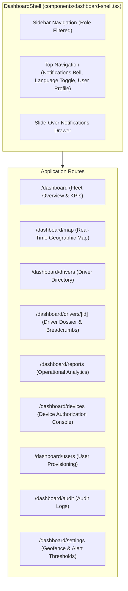

# Web Administrative Console

> Practical Single Source of Truth for the Tracker Web Administration Console.  
> Verified against production Next.js 14 pages, shell components, and API integration layers (`v1.2.0`).

---

## 1. Overview & Technology Stack

The Tracker Web Administrative Console (`apps/web`) provides desktop and tablet browser visibility for dispatchers, operations managers, and business administrators.

- **Framework**: Next.js 14.2 (App Router, Server Components & Client Components).
- **Styling**: Tailwind CSS with custom RTL directional logical properties (`start-0`, `end-0`, `ms-auto`, `border-e`).
- **Mapping**: Leaflet 1.9 & React-Leaflet with OpenStreetMap tiles.
- **Icons**: Lucide React.
- **Localization**: Native bilingual engine (`ar` Arabic RTL default, `en` English LTR) with Western Arabic numeral formatting (`1, 2, 3`).

---

## 2. Page Directory & Role Permissions

| Route | Page Name | Primary Operational Purpose | Access Roles |
| :--- | :--- | :--- | :--- |
| **`/login`** | Sign In | Credential authentication with bilingual validation errors. | Public |
| **`/dashboard`** | Fleet Overview | Real-time KPI summary cards (Total Drivers, Active Shifts, Online, At Restaurant, Moving, Stopped, Offline, Low Battery) and quick driver list. | `ADMIN`, `CALL_CENTER` |
| **`/dashboard/map`** | Interactive Map | Full-screen Leaflet map rendering restaurant geofence circle, color-coded driver pins, heading arrows, and status filters. Auto-refreshes every 5s. | `ADMIN`, `CALL_CENTER` |
| **`/dashboard/drivers`** | Drivers Directory | Searchable roster of drivers with employee ID, active status, battery indicators, and quick links. | `ADMIN`, `CALL_CENTER` |
| **`/dashboard/drivers/[id]`**| Driver Dossier | Comprehensive profile: live telemetry, shift timeline, location breadcrumbs, activity history, and **Force End Shift** action. | `ADMIN`, `CALL_CENTER` |
| **`/dashboard/reports`** | Operational Reports | Analytics console: date range filters (Today, Yesterday, Week, Month, Custom), hours worked, distance traveled, stationary vs. moving time. | `ADMIN`, `CALL_CENTER` |
| **`/dashboard/devices`** | Device Management | Hardware authorization table: view UUIDs, app versions, last seen timestamps, and execute **Reset Device** or **Assign Device**. | `ADMIN` only |
| **`/dashboard/users`** | User Management | Provision, edit, deactivate, or permanently delete system accounts across roles. | `ADMIN` only |
| **`/dashboard/audit`** | Audit Logs | Filterable audit trail displaying timestamps, actor emails, actions, entity IDs, IP addresses, and redacted parameters. | `ADMIN` only |
| **`/dashboard/settings`** | System Settings | Configure restaurant coordinates, geofence radius slider (10m - 50,000m), and alert duration thresholds. | `ADMIN` only |
| **`/download`** | Download Portal | Public release page displaying latest APK version, release notes, SHA-256 hash, and direct download button. | Public |

---

## 3. Key UI Workflows & Features

### 3.1 Real-Time Notifications Drawer

- Accessible via the Bell icon in the top header.
- Displays an unread badge indicator updated via 15-second background polling.
- Clicking the Bell opens a slide-over panel showing recent notifications categorized by severity (`INFO`, `WARNING`, `CRITICAL`).
- Supports **Mark as Read**, **Mark All as Read**, and **Resolve Alert** with instant state synchronization.

### 3.2 Live Geographic Fleet Map (`/dashboard/map`)

- Renders a circular polygon representing the restaurant geofence perimeter (default 150m radius).
- Drivers are rendered as dynamic markers:
  - 🟢 **Moving**: Emerald marker with directional heading rotation.
  - 🟣 **At Restaurant**: Purple home marker inside geofence.
  - 🟡 **Stopped**: Amber marker outside restaurant.
  - ⚪ **Offline**: Grey marker.
- Clicking any driver pin opens an interactive popup displaying driver name, employee ID, battery level, current speed, and link to their full dossier.

### 3.3 Driver Dossier & Administrative Force End (`/dashboard/drivers/[id]`)

- Displays live location coordinates, battery percentage, charging status, and network connection type.
- **Force End Shift Button** (Admin only): Allows managers to immediately terminate an open shift if a driver leaves without clocking out. Triggers a confirmation dialog and refreshes the shift status instantly.
